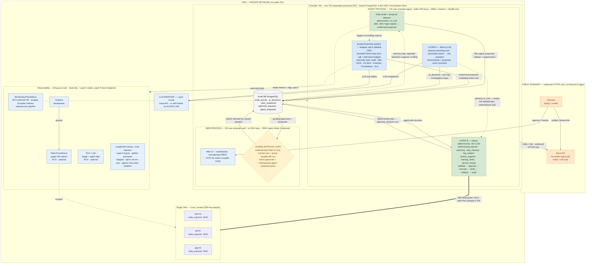

# Errander-AI — System Architecture

> Supervised agentic AI · two-layer safety model · AI investigates and recommends, humans approve, deterministic code acts.
> As-built as of **2026-07-10** (post-R3 process split · detect-and-propose Phases 1–5 shipped).
> Renders inline on GitHub. The editable draw.io version is [`docs/diagrams/errander-system-architecture.drawio`](docs/diagrams/errander-system-architecture.drawio) (same as-built state, swim-lane layout).

## Reading the diagram

- **Layer A (blue)** thinks, recommends, and — since detect-and-propose (2026-07-07) — *proposes work*: the advisory planning note, the post-batch report, the `--ask` assistant, and the **Investigation Agent** (a bounded ReAct loop over read-only tools, opt-in via `investigation_agent_enabled`, per-hop redaction + `investigation_agent_step` audit rows). It never touches a VM, and it is import-isolated from Layer B (test-enforced — the agent never imports the approval or proposal stores; its caller files proposals).
- **Detect-and-propose (shipped Phases 1–4):** the daily probe's deterministic detector turns disk/drift/login signals into evidenced `agent_proposals`; probe findings can (opt-in, `investigation_trigger_enabled`) trigger the Investigation Agent for deeper evidence. Proposals land in the `/ui/proposals` queue with an AGENT-ORIGINATED badge. **Approving a proposal originates work — it is not execution authorization**: the approved action runs through the normal Layer B path with every gate intact (maintenance window, VM lock, drift checks, exact-object approval). A memory loop suppresses re-proposing work that operators repeatedly reject (default: 2 rejections within 14 days).
- **Human approval gate (amber)** sits between thinking and acting — mandatory for every live change. Each request is a durable row in `approval_requests`: decisions are atomic (exactly one winner) and survive an agent restart (a reconciler job recovers pending ones). The **only** decision surface is the authenticated Web UI with users/groups RBAC — every decision records a named user + group; Slack notifies and links but cannot decide.
- **Layer B (green)** is deterministic Python. Since R1 the batch plan's membership and ordering are 100% deterministic — the LLM can only attach the clearly-labeled advisory note, never change what executes. The thick **SSH edge is the only path that changes a target VM**.
- **R3 process split:** the agent process (`errander-agent`, holds SSH keys, `:9090` metrics-only) and the web process (`errander-web`, no SSH keys, `:9091`, RBAC + TOTP) are separate OS users; the shared PostgreSQL database is the **only** link between them, with table-level role grants (the web role cannot write audit tables). The Layer A / Layer B boundary is an OS-enforced privilege boundary, not just a code convention.
- **Prometheus, twice:** a BYO Monitoring Prometheus on an external VM scrapes Errander's own `/metrics` (who watches the watcher); a separate Fleet Prometheus scrapes target node_exporters `:9100` for Layer A to read when investigating fleet health. Neither runs on the controller.
- **Nothing on this diagram is aspirational** — every component is shipped. LangSmith tracing + the golden-scenario eval harness landed with detect-and-propose Phase 5 (opt-in via the standard `LANGSMITH_*`/`LANGCHAIN_*` env vars; `--eval-golden-scenarios` runs offline). The Dashboard Chat / Operator Chat Interface shown in older revisions was removed from core scope on 2026-06-23 and lives on as a separate future project.
- Everything inside **VPN** is private; the only outbound path is HTTPS to Slack (and optionally LangSmith).
- **Observability lane** is bring-your-own and read-only — the daily probe and Layer A may read these sources; Layer B never depends on them.
