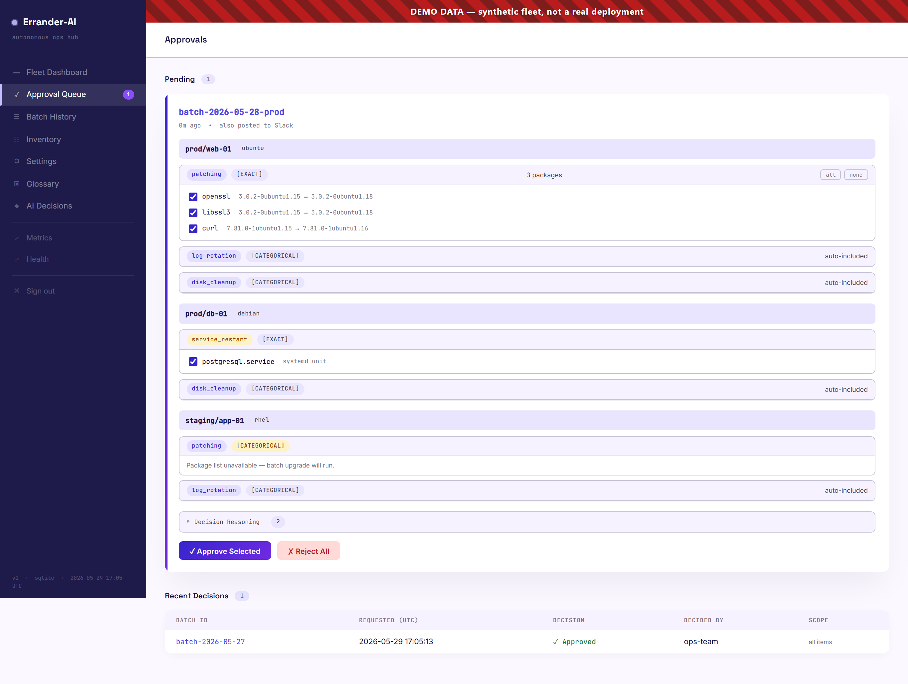
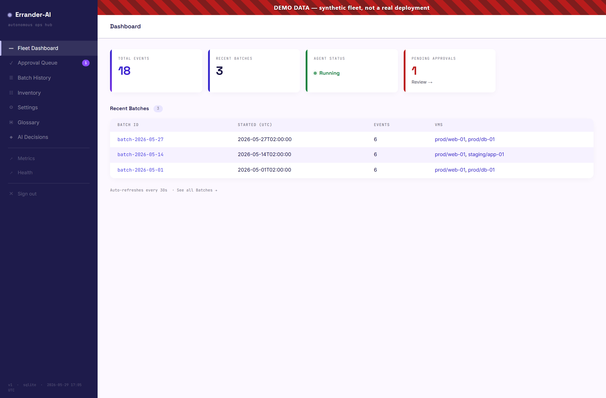
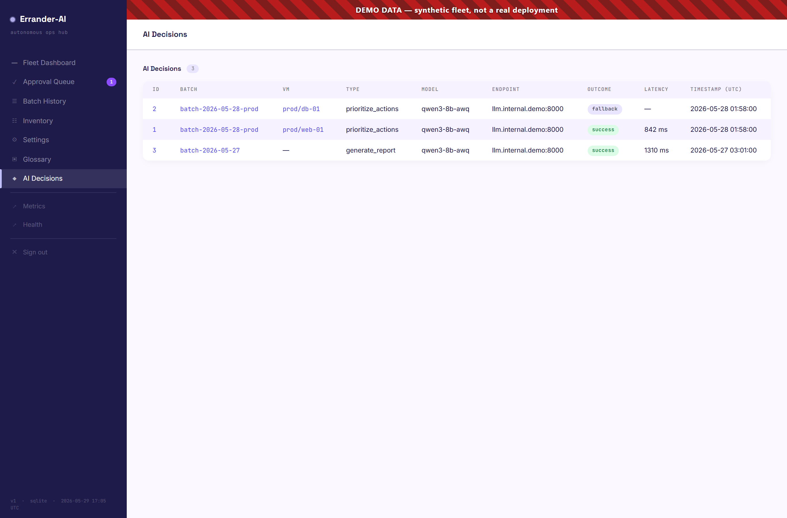
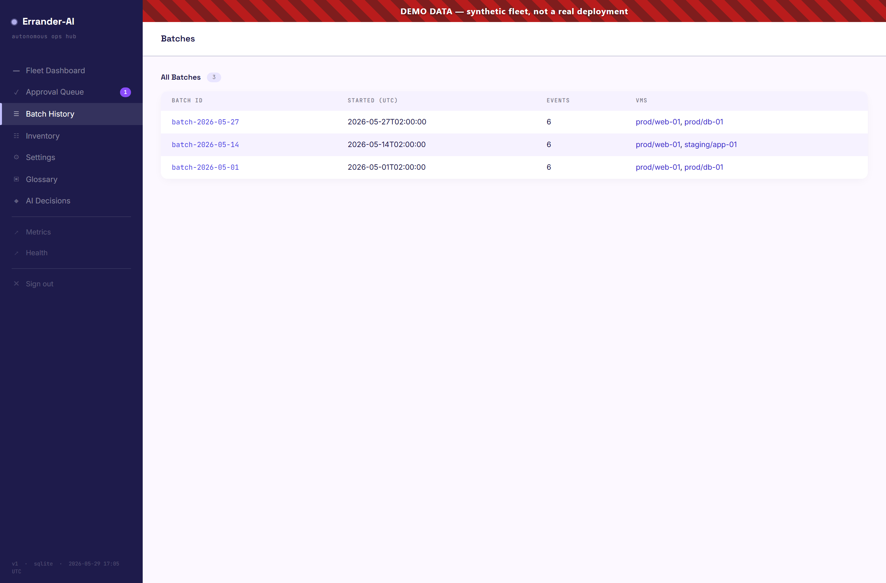
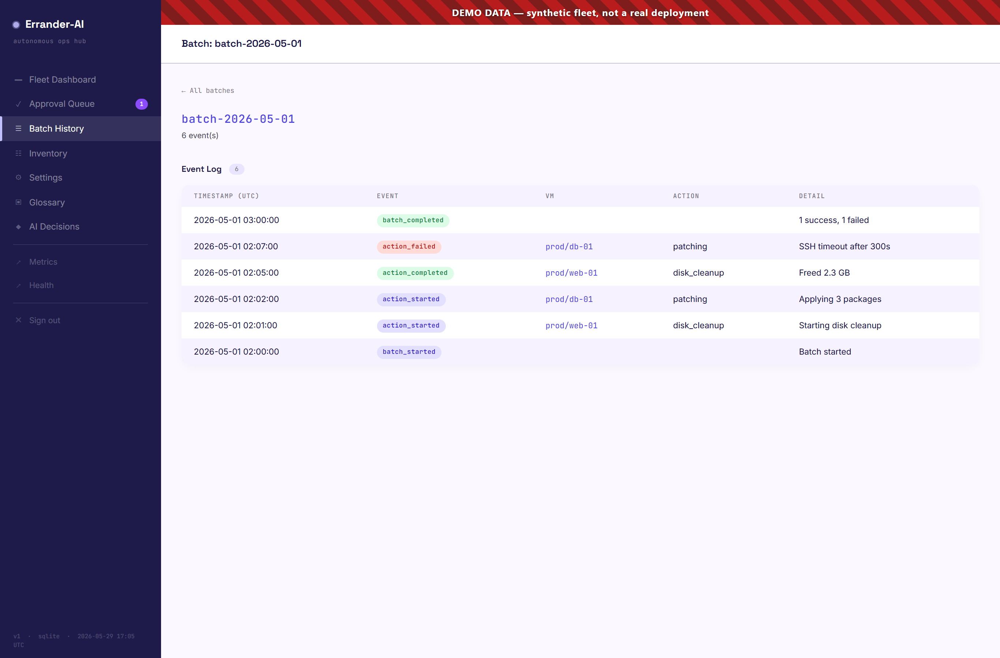
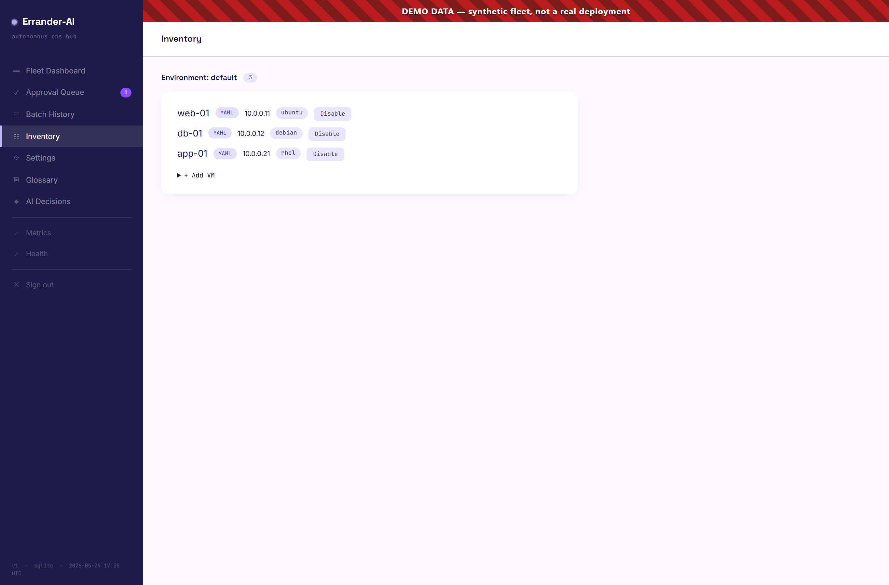

# Errander-AI

**Supervised agentic AI for Linux fleet maintenance — the LLM decides and explains, humans approve, deterministic code acts.**

Errander-AI is a **supervised agentic AI SRE platform** for small-to-medium Linux fleets. It assesses each host, prioritizes what needs doing, and performs non-kernel patching, log rotation, Docker hygiene, disk cleanup, and backup verification — with safety gates, rollback, idempotency, and full audit logging. It runs on a single controller VM and manages any number of target servers over SSH. **Every live change requires human approval (Slack or Web UI) and is executed by deterministic Python — never by the LLM.**

| Action | Default | Opt-in required | Risk tier |
|---|---|---|---|
| `patching` | ✅ enabled | No | MEDIUM — HITL approval + maintenance window |
| `disk_cleanup` | ✅ enabled | No | LOW — whitelist-bounded, non-destructive |
| `log_rotation` | ✅ enabled | No | LOW — compresses, does not delete |
| `docker_hygiene` | ❌ disabled | Yes — install v2 wrappers, set `enabled: true` | MEDIUM — object-level Slack/web approval |
| `backup_verify` | ❌ disabled | Yes — requires `backup:` config section | LOW |
| `service_restart` | ❌ disabled | Yes — install wrapper + declare `restartable_units` | HIGH — Slack approval always required, operator-triggered |

Each action is independently enabled per environment in `inventory.yaml` (`actions.<name>.enabled`). Actions default as shown — no YAML required to run the enabled defaults.

```bash
# Trigger a service restart (operator-initiated, always requires Slack approval)
uv run python -m errander --restart-service production --unit nginx.service --vm prod-web-01 --dry-run
uv run python -m errander --restart-service production --unit nginx.service --vm prod-web-01
```

Errander-AI is built on a **two-layer architecture**. **Layer A (the brain)** uses generative AI to prioritize, explain, correlate, and summarize maintenance for operators — it recommends, never acts. **Layer B (the hands)** is deterministic Python that gathers state and applies approved fixes — the LLM is never in the path that changes infrastructure. That is what *supervised agentic* means here: **agentic** in how it assesses and orchestrates a fleet, **supervised** by mandatory human approval, with **generative AI bounded to the advisory layer**. See [`docs/AI-ARCHITECTURE.md`](docs/AI-ARCHITECTURE.md) and [`docs/OBSERVABILITY.md`](docs/OBSERVABILITY.md).

100% open source. Cloud-agnostic. No SaaS dependencies except Slack (optional).

**Supported target OS:** Ubuntu 20.04+, Debian 11+, RHEL/Rocky/Alma 8+.

> See [`docs/AI-ARCHITECTURE.md`](docs/AI-ARCHITECTURE.md) for the canonical two-layer AI safety model.
>
> **MCP belongs in the operator brain, not in the execution hands.**

## Screenshots

> ⚠️ **All screenshots below use synthetic demo data** — a fake fleet (`web-01`, `db-01`, `app-01` on `10.0.0.x`), fake batches, and a fake LLM endpoint. No real hosts, IPs, tokens, or Slack workspace are shown. Each image carries a red **"DEMO DATA"** banner. Regenerate them anytime with `uv run python scripts/capture_ui_screenshots.py`.

**Approval Queue — exact-object, human-in-the-loop.** Every live change is approved against the exact objects it will touch (per-package checkboxes, named systemd units), never a vague action category. Low-risk categorical actions are auto-included and honestly labelled.



**Fleet Dashboard.** At-a-glance event totals, recent batches, agent status, and the pending-approval count.



**AI Decision log (Layer A observability).** Every LLM call is recorded — model, endpoint, latency, and whether it succeeded or fell back to the deterministic default — so you can always see *why* a plan was ordered the way it was.



**Batch history & per-batch event log.** Full audit trail, one row per action, including failures.

| Batch history | Batch detail |
|---|---|
|  |  |

**Inventory.** The fleet as Errander sees it, with per-VM enable/disable and ad-hoc additions.



## What Errander-AI Is — and Is Not

Errander-AI is intentionally narrow. Knowing what it deliberately excludes is as important as knowing what it does.

**What it is:** a safety-gated, supervised execution layer for the recurring Linux fleet maintenance toil you'd otherwise handle with cron, manual SSH, or a fragile playbook. It inspects each host's actual state, proposes a prioritized plan, and executes only after human approval — through deterministic Python, with rollback and full per-action audit.

Errander-AI **is**:

- A supervised maintenance agent for small-to-medium Linux fleets (Ubuntu / Debian / RHEL family)
- A deterministic executor of a fixed action set — non-kernel patching, disk cleanup, log rotation, Docker hygiene, backup verification, and operator-triggered service restart
- Human-in-the-loop by design — every live change is approved via Slack or Web UI against an **exact-object** plan, never a vague action category
- LLM-enhanced but never LLM-dependent — the AI prioritizes, explains, and summarizes; hardcoded fallbacks keep it running when the LLM is down
- Fully private — no public IP, no inbound webhooks; outbound HTTPS to Slack only
- Auditable — every action is logged before and after execution, one row per object

Errander-AI is **not**:

- A monitoring system — pair it with Prometheus, ELK, or your existing stack. It *reads* from them; it does not replace them
- An application / runtime manager — it does not deploy or manage Tomcat, Nginx config, Kubernetes, Java GC, or databases
- An Ansible / Salt / Puppet replacement — it runs no arbitrary playbooks and enforces no desired-state configuration
- A fully autonomous SRE — it never self-approves; HITL is mandatory for every live change
- A kernel patching tool — kernel operations are hardcoded out of scope
- An arbitrary-command runner — the action set is fixed and audited; the LLM never generates shell commands and never touches a terminal

**v1 target scope — what it can and cannot reach:**

Errander-AI connects to targets over SSH. The target must be a Linux host OS you can SSH into. This means:

| Target type | v1 support | Notes |
|---|---|---|
| Linux VMs (Ubuntu / Debian / RHEL) | ✅ Fully supported | The primary use case |
| Bare-metal Linux servers | ✅ Supported | Same SSH + sudoers model |
| Docker containers (on a Linux VM) | ✅ Supported | Via the docker_hygiene sub-graph on the host |
| **Serverless functions** (Lambda, Azure Functions, Cloud Run, GCF) | ❌ Not supported | No SSH surface — requires cloud provider API |
| **Managed cloud services** (RDS, Azure SQL, DynamoDB, ElastiCache, Cosmos DB) | ❌ Not supported | No OS access — requires cloud SDK |
| **Container orchestration** (Kubernetes, ECS, GKE, AKS) | ❌ Not supported | Requires Kubernetes API, not systemd + SSH |
| **PaaS runtimes** (App Service, Cloud Run, Heroku dynos) | ❌ Not supported | No host OS access |
| Windows VMs | ❌ Not supported | Action set assumes POSIX tools and apt/dnf/yum |

If your fleet is primarily serverless or managed cloud services, v1 covers only the VMs that still exist alongside them. The supervised-agentic pattern (assess → approve → execute → audit) is architecturally sound for cloud resources, but the transport and action implementations would need cloud SDK integrations — that is v2+ scope, not a config flag.

---

## How It Works

The LLM **never connects to target servers**. It never sees a terminal. It never runs a command.

```
Master VM (Agent + LLM)              Target VMs
+-------------------------+          +-----------+
|  Errander-AI Agent      |---SSH--->| Ubuntu-01 |
|  +-------------------+  |          +-----------+
|  | LangGraph         |  |          +-----------+
|  | (decision engine) |  |---SSH--->| RHEL-02   |
|  +---------+---------+  |          +-----------+
|            |             |          +-----------+
|  +---------v---------+  |---SSH--->| Debian-03 |
|  | LLM               |  |          +-----------+
|  | (your choice)     |  |          +-----------+
|  +-------------------+  |---SSH--->| Debian-N  |
+-------------------------+          +-----------+
```

The flow:

1. **Agent** SSHes into a target VM, runs discovery commands (`df -h`, `apt list --upgradable`, `docker system df`)
2. **Agent** collects the output and sends it to the **LLM**: "Given this system state, prioritize these maintenance actions"
3. **LLM** responds with structured JSON: `["disk_cleanup", "patching", "log_rotation"]`
4. **Agent** takes that answer and executes the plan via SSH — through hardcoded safety gates
5. **LLM** generates a human-readable report of what happened

The LLM is a **brain in a jar** — it thinks, but it has no hands. The agent is the hands.

### The two layers in one run

That flow is exactly the **two-layer model** ([`docs/AI-ARCHITECTURE.md`](docs/AI-ARCHITECTURE.md)) in action. Mapping each step:

| Step in a run | Who does it | Layer |
|---|---|---|
| SSH in, gather state (`df -h`, `apt list --upgradable`, `docker system df`) | deterministic Python | **B** — the hands, *reading* |
| Pull Prometheus / ELK context (if opted in) | deterministic Python | **B** gathers → feeds **A** |
| **Look at the state and recommend a prioritized plan** | the **LLM** (hardcoded fallback if down) | **A** — the brain |
| Approve / reject (Slack reaction or Web UI) | **you** | — the boundary |
| **Apply the approved fix** — execute, verify, roll back, audit | deterministic Python | **B** — the hands, *acting* |
| Summarize what happened | the **LLM** | **A** — the brain |

The shape to remember:

- **Layer A (the brain)** *thinks and recommends* — it looks at gathered facts and proposes a plan. It **never** changes a VM.
- **Layer B (the hands)** *gathers facts and applies fixes* — deterministic Python, only after you approve, with audit + rollback. **No LLM in this path.**
- **You sit in the middle.** The brain proposes → you approve → the hands execute.

So Layer B runs **twice** in a single maintenance run (gather facts → … → apply fix), with the Layer A recommendation and your approval in between. That gap — brain proposes, human approves, deterministic hands act — *is* the safety architecture.

### AI vs Pure Automation

| Aspect | Pure Automation (Ansible) | Errander-AI |
|--------|--------------------------|-------------|
| "Patch all servers" | Runs same playbook on every server | Examines each server's state, decides what to prioritize |
| Server A: 2% disk, Server B: 90% disk | Same playbook on both | Prioritizes disk cleanup on B, skips cleanup on A |
| Patching fails | Stops or retries blindly | LLM analyzes the error, recommends retry vs rollback vs escalate |
| Reporting | Template output | LLM writes a context-aware summary of what happened and why |
| Nothing to do | Runs anyway | Idempotent — detects "already clean" and skips (like Ansible's changed/ok) |

### Graceful Degradation

The agent is **LLM-enhanced, not LLM-dependent**. If the LLM goes down:

- Action prioritization falls back to hardcoded risk-tier ordering
- Failure analysis falls back to heuristic-based recommendations
- Report generation falls back to template-based summaries

The agent never stops working. It degrades from "AI-assisted" to "smart automation."

---

## Architecture

### Three-Level Graph Structure (LangGraph)

```
Level 1: Batch Orchestrator
  init_batch -> validate_window -> validate_targets -> fan_out -> collect -> report -> [approval] -> END
                                                          |
                                                    Send() per VM

Level 2: Per-VM Maintenance Graph (one per target)
  lock -> discover -> plan_actions -> dispatch -> check_more -> audit -> unlock
                                        |
                                  Sub-graph per action

Level 3: Action Sub-Graphs
  validate -> assess -> [snapshot] -> execute -> verify -> END
                  |                                |
            (nothing to do?                  (dry-run?
             skip execute)                    skip verify)
```

- **Multi-VM parallelism**: LangGraph `Send()` fan-out processes the fleet concurrently
- **Action isolation**: A bug in docker prune logic cannot affect the patching flow
- **Independent testability**: Each sub-graph tested without the parent
- **Extensibility**: Adding a new action type = write a sub-graph + register it in the dispatcher

### Network Architecture

```
+--------------------------------------------------+
|                  VPN (private)                    |
|                                                   |
|  +---------------+     +----------------------+  |
|  | LLM endpoint  |     | Agent VM             |  |
|  | (cloud or     |<----| - Errander-AI agent  |  |
|  |  self-hosted) |     | - APScheduler        |  |
|  +---------------+     | - Slack poller        |  |
|                         | - Audit DB (SQLite)  |  |
|                         | - Prometheus /metrics|  |
|                         | - Web UI :9090/ui    |  |
|                         +-----+------+---------+  |
|                               |      |            |
|                          SSH  |      | HTTPS      |
|                               |      | (outbound  |
|                               v      |  only)     |
|                      +------------+  |            |
|                      | Target VMs |  |            |
|                      | (private)  |  |            |
|                      +------------+  |            |
+--------------------------------------+-----------+
                                       |
                                       v
                              +-----------------+
                              | Slack API       |
                              | (public)        |
                              +-----------------+
                                       ^
                                       |
                              +-----------------+
                              | Operator        |
                              | (mobile/laptop) |
                              +-----------------+
```

- Agent VM has **no public IP** — fully private
- All Slack communication is **outbound HTTPS** (polling, not webhooks)
- LLM endpoint is a **private IP** inside VPN
- SSH to target VMs is **within the VPN**
- No nginx, no inbound webhooks, no TLS certificates to manage

---

## Action Types

| Action | Risk Tier | What It Does | Idempotency | Rollback |
|--------|-----------|-------------|-------------|----------|
| **Disk Cleanup** | Low | Clean `/tmp`, package cache, journal logs, orphaned deps | Skips if nothing reclaimable | None needed (safe paths only) |
| **Log Rotation** | Low | Find oversized logs, manual gzip+truncate (logrotate not used) | Skips if no large files found | None needed (data compressed, not deleted) |
| **Docker Hygiene** | Medium | Rich assessment: dangling images, stopped containers, unused images, volumes, build cache — exact-object Slack/web approval before removal | Skips classes with nothing to do | Re-pull images if needed (prune is destructive by nature) |
| **Patching** | Medium | Non-kernel `apt upgrade` / `dnf upgrade` with kernel exclusion | Skips if already up-to-date | Full — version snapshot before, batch rollback on failure |
| **Backup Verify** | Low | Read-only check: backups exist, are recent, non-zero size | Inherently idempotent (read-only) | N/A |

### Safety Gates

| Tier | Approval | Example |
|------|----------|---------|
| **Low** | Automatic (categorical) | Disk cleanup, log rotation, backup verify |
| **Medium** | Exact-object Slack/web approval | Non-kernel patching, Docker hygiene |
| **High** | Human Slack approval — always required | Service restart (operator-triggered only) |
| **Critical** | **Blocked — never automated** | Kernel operations, data deletion |

Kernel packages (`linux-*`, `linux-image-*`, `kernel-*`) are **always excluded** from patching. This is a hardcoded check, never an LLM decision.

### Disk Cleanup Whitelist

Only these paths are safe to clean — **hardcoded, never LLM-decided**:

- `/tmp` (files older than configurable threshold)
- apt/yum package cache
- Journal logs (`journalctl --vacuum-time`)
- Orphaned package dependencies

Anything not on this whitelist requires human approval.

---

## Approval Flow

Dual-channel approval — Slack reactions and Web UI buttons race:

1. Agent completes dry-run and posts the plan to `#errander-approvals` on Slack
2. **Race**: first channel to decide wins
   - Slack: operator reacts with :white_check_mark: (approve) or :x: (reject) — approves all items
   - Web UI: operator uses `/ui/approvals` — per-item granularity (approve individual packages, service restarts; categorical actions auto-included)
3. Timeout after 30 minutes (configurable) = auto-reject

Web UI approval cards show: per-VM / per-action plan with checkboxes for each item, a **Decision Reasoning** section (LLM vs deterministic fallback, model, latency), and the operator's decision is recorded by username (not a generic "ui" label).

All Slack communication is outbound HTTPS. No webhooks, no inbound traffic.

---

## Stack

| Component | Technology | Notes |
|-----------|-----------|-------|
| Language | Python 3.12+ | Async-first, strict typing |
| Agent Framework | LangGraph | State machines for decision workflows |
| LLM | Any OpenAI-compatible endpoint | User-choice at install: cloud API (OpenAI, Anthropic, Groq, Azure AI Foundry, etc.) **or** self-hosted vLLM running Qwen3-8B-AWQ on a 16 GB VRAM GPU (Tesla T4 reference). See `docs/LLM-PROVIDERS.md`. |
| LLM Client | OpenAI Python SDK | Pointed at configurable base URL |
| SSH | asyncssh | Async-native, key-based auth only, connection pooling |
| Notifications | Slack API | Outbound HTTPS only, reaction polling |
| Scheduling | APScheduler | Agent owns its own schedule |
| Audit Trail | SQLite (v1) | PostgreSQL planned for v2 |
| Observability | Prometheus + Web UI | `/metrics`, `/health`, `/ui` on port 9090 |
| VM Locking | File-based (v1) | Valkey (Redis fork) planned for v2 |
| Testing | pytest + pytest-asyncio + Playwright | 2507 tests |
| Linting | ruff | |
| Type Checking | mypy (strict mode) | |
| Package Manager | uv | |

**No cloud-provider-specific services.** Everything runs on any Linux VM with Docker.

---

## Project Structure

```
errander/
  agent/                    # LangGraph agent definitions
    graph.py                # Batch orchestrator (fan-out to VMs)
    vm_graph.py             # Per-VM maintenance graph
    decisions.py            # LLM-powered decisions (with hardcoded fallback)
    subgraphs/
      disk_cleanup.py       # Disk space management
      log_rotation.py       # Log compression and rotation
      docker_hygiene.py     # Rich Docker assessment + object-level removal (v1.1)
      patching.py           # Non-kernel OS patching
      backup_verify.py      # Backup verification (read-only)
      service_restart.py    # Operator-triggered systemd unit restart
  safety/                   # Safety architecture
    validators.py           # Pre-execution validation (kernel exclusion, whitelist)
    rollback.py             # Rollback strategies per action type
    approval.py             # Dual-channel approval (Slack + Web UI)
    hygiene_approval.py     # docker_hygiene approval surface (Slack formatter + parser + manager)
    locking.py              # VM-level locking (file-based v1)
    audit.py                # Audit logging (async SQLite)
  execution/                # Command execution layer
    ssh.py                  # asyncssh connection management + pooling
    commands.py             # PackageManager strategy (AptManager, DnfManager)
    os_detection.py         # Runtime OS detection + config verification
    sandbox.py              # Dry-run / sandbox execution mode
  integrations/             # External service integrations
    slack.py                # Slack API client (outbound only)
    signed_url.py           # HMAC-signed time-limited tokens (web approval URLs)
    llm.py                  # LLM client (OpenAI SDK → any OpenAI-compatible endpoint)
  observability/            # Metrics and monitoring
    metrics.py              # Prometheus metrics + Web UI + /metrics endpoint
  config/                   # Configuration
    settings.py             # Global settings + env var loading
    inventory.py            # VM inventory loader
    policies.py             # Maintenance policies (relaxed/moderate/strict)
    schema.py               # Config YAML schema validation
  scheduling/               # Scheduling
    scheduler.py            # APScheduler setup
    windows.py              # Maintenance window enforcement
  main.py                   # Entry point
tests/                      # Mirrors src structure (2507 tests)
deploy/
  vllm/
    docker-compose.yml      # vLLM container (GPU passthrough)
docs/
  SPEC.md                   # Full project specification
  learning/                 # Per-feature learning docs
example/
  inventory.yaml            # Reference inventory config
  settings.yaml             # Reference settings config
```

---

## Quick Start

### Prerequisites

- Python 3.12+
- [uv](https://docs.astral.sh/uv/) package manager
- SSH key access to target VMs
- (Optional) Slack bot token for notifications
- (Optional) An LLM endpoint for AI-powered decisions — either a cloud API (OpenAI, Anthropic, Groq, etc.) or a self-hosted vLLM on a 16 GB VRAM GPU. The agent runs without one using hardcoded fallbacks.

### Install and Run Tests

```bash
git clone https://github.com/psc0des/Errander-AI.git errander
cd errander
uv sync
uv run pytest
```

> **New Linux controller?** One command as admin: `curl -fsSL https://raw.githubusercontent.com/psc0des/Errander-AI/main/scripts/bootstrap.sh | bash` — then `sudo su - errander-agent`, clone the repo, and run `bash scripts/install.sh`. On Windows: `scripts/bootstrap.ps1` handles everything automatically.

### Configure

Run the interactive setup script — it prompts for everything and writes `.env` + `inventory.yaml`:

```bash
bash scripts/configure.sh
```

Or set env vars manually:

```bash
export ERRANDER_LLM_BASE_URL="https://<resource>.openai.azure.com/openai/v1/"
export ERRANDER_LLM_MODEL="<deployment-name>"
export ERRANDER_LLM_API_KEY="<key>"
export ERRANDER_AUDIT_DB_URL="errander.sqlite"

# Optional — Web UI auth (omit to disable login)
export ERRANDER_UI_USER="admin"
export ERRANDER_UI_PASSWORD="<password>"
export ERRANDER_UI_BIND="0.0.0.0"   # set to 127.0.0.1 for SSH-tunnel-only

# Optional — Slack notifications
export ERRANDER_SLACK_BOT_TOKEN="xoxb-..."
export ERRANDER_SLACK_CHANNEL_ID="C0..."
```

Create `inventory.yaml` (see `example/inventory.yaml`) and optionally `settings.yaml` (see `example/settings.yaml`).

### Run

```bash
# Dry-run a batch immediately (safe — no changes made)
uv run python -m errander --run-now --env dev --dry-run

# Check LLM connectivity
uv run python -m errander --check-llm

# View audit trail
uv run python -m errander --audit --batches

# Start the long-lived agent (scheduler mode)
uv run python -m errander
```

### Web UI

After starting, visit `http://<controller-ip>:9090/ui` (or `http://localhost:9090/ui` locally):

> **Auth:** When `ERRANDER_UI_USER` / `ERRANDER_UI_PASSWORD` are set in `.env`, the UI requires a login. Visit `/ui/login`, enter your credentials, and the agent issues a session cookie (8-hour TTL). `/metrics` and `/health` remain open regardless.

- `/ui/login` — Sign in (session-cookie auth)
- `/ui` — Dashboard (status, event count, recent batches)
- `/ui/batches` — Batch history
- `/ui/batches/{id}` — Batch detail with all events
- `/ui/vms/{vm_id}` — VM history across all batches
- `/ui/approvals` — Pending approvals with Approve/Reject buttons
- `/metrics` — Prometheus metrics
- `/health` — Health check

> **Binding:** By default (`ERRANDER_UI_BIND=0.0.0.0`) the UI is reachable on all interfaces. Set `ERRANDER_UI_BIND=127.0.0.1` to restrict to SSH-tunnel-only access.

---

## Key Commands

```bash
uv run pytest                                          # Run all 2507 tests
uv run ruff check .                                    # Lint
uv run mypy .                                          # Type check
uv run python -m errander --run-now --env dev --dry-run # Dry-run a batch
uv run python -m errander --probe-now dev              # Daily probe (read-only, no maintenance)
uv run python -m errander --ask "Any disk issues?" --env dev  # LLM fleet analysis (Layer A)
uv run python -m errander --check-targets dev          # Pre-flight VM readiness check
uv run python -m errander --check-llm                  # Verify LLM endpoint
uv run python -m errander --audit --batches            # View recent batches
uv run python -m errander --audit --batch-id <id>      # Events for a batch
```

---

## Configuration

### Inventory (`config/inventory.yaml`)

Defines target VMs grouped by environment:

```yaml
environments:
  production:
    policy: strict
    maintenance_window: "02:00-06:00"
    maintenance_days: ["Saturday", "Sunday"]
    hosts:
      - vm_id: prod/web-01
        hostname: 10.0.1.10
        ssh_user: errander-ai
        ssh_key_path: ~/.ssh/errander_prod
        os_family: ubuntu

  dev:
    policy: relaxed
    hosts:
      - vm_id: dev/test-01
        hostname: 10.0.2.10
        ssh_user: errander-ai
        ssh_key_path: ~/.ssh/errander_dev
        os_family: ubuntu
```

### Policies

| Policy | Auto-Approve | Human Approve | Use Case |
|--------|-------------|---------------|----------|
| **relaxed** | Low, Medium, High | — | Dev environments |
| **moderate** | Low | Medium, High | Staging |
| **strict** | Low | Medium, High | Production |

Critical actions are **always blocked** regardless of policy.

### Maintenance Windows

Agent refuses to run outside defined windows unless `--force` with a mandatory reason:

```bash
# This will be blocked outside the maintenance window
uv run python -m errander --run-now --env production

# Override with reason (logged to audit trail)
uv run python -m errander --run-now --env production --force --force-reason "emergency patching for CVE-2024-XXXX"
```

---

## Observability

> **Full reference:** [`docs/OBSERVABILITY.md`](docs/OBSERVABILITY.md) — per-layer observability for operators and coding agents (audit trail, AI decision log, Prometheus, planned LangSmith).

Errander-AI has two layers (see [`docs/AI-ARCHITECTURE.md`](docs/AI-ARCHITECTURE.md)), and each is observed differently. Knowing which tool answers which question keeps the audit trail authoritative and the reasoning debuggable:

| Layer | What it is | The question it answers | What you watch it with |
|-------|-----------|-------------------------|------------------------|
| **Layer A — the brain** | LLM reasoning in `agent/decisions.py` — prioritizes, analyzes failures, writes reports. Never touches a VM. | *Why* did the agent choose this plan? | AI Decisions UI (`/ui/ai-decisions`); optionally LangSmith for richer LangGraph traces |
| **Layer B — the hands** | Deterministic Python in `execution/` — SSH, commands, rollback. No LLM in this path. | *What* did the agent actually do? | **Prometheus metrics + the audit trail** |

The key split: **the LLM's reasoning is not a record of what happened to your infrastructure** — a plan can be rejected at approval, and the LLM is deliberately kept out of execution. So the **audit trail is the source of truth for actions**, Prometheus is the source of truth for execution health, and LangSmith (if used) only ever observes Layer A.

### Prometheus Metrics

The agent **exposes** its own metrics on `/metrics` (port 9090, Prometheus text exposition format). It does **not** bundle a Prometheus server — you run that yourself (see below).

| Metric | Type | Description |
|--------|------|-------------|
| `errander_actions_total` | Counter | Actions by type, status, VM |
| `errander_action_duration_seconds` | Histogram | Action execution time |
| `errander_batch_duration_seconds` | Histogram | Batch total time |
| `errander_ssh_errors_total` | Counter | SSH errors by VM and reason |
| `errander_llm_requests_total` | Counter | LLM calls by outcome (`success` / `fallback` / `timeout` / `error`) |
| `errander_approval_wait_seconds` | Histogram | Time waiting for approval |
| `errander_vm_lock_held_seconds` | Histogram | Lock hold duration |

### Installing Prometheus on the controller node

Prometheus runs **on the controller node** (the same Agent VM that runs Errander-AI). It scrapes the agent's local `/metrics` endpoint — no inbound traffic to the agent from outside the VPN, consistent with the private-by-design network model.

There are **two distinct Prometheus relationships** in this system — keep them separate:

1. **Prometheus → Errander** — Prometheus scrapes the agent's own `/metrics` (the table above). This is what you set up below.
2. **Errander → Prometheus / node_exporter** — the agent *reads* host metrics from node_exporter on the **target VMs** (`observability/vm_metrics.py`, `integrations/prometheus.py`) to inform Layer A decisions. Configured per-target, separate from the scrape job below.

**Easiest — let the installer do it.** `install.sh` offers an opt-in Prometheus step during setup, or run the standalone script anytime:

```bash
bash scripts/install-prometheus.sh
```

It installs the official Prometheus binary (works on any distro — no apt/dnf package needed), creates a `prometheus` system user + systemd unit, writes a scrape config pointing at the agent's local `/metrics`, and starts the service. It listens on **port 9091** to avoid colliding with the agent's UI/metrics on 9090. Override defaults via env vars: `PROM_VERSION`, `AGENT_METRICS_PORT`, `PROM_PORT`.

The scrape config it writes (loopback, since Prometheus and the agent are co-located):

```yaml
# /etc/prometheus/prometheus.yml  (generated by install-prometheus.sh)
scrape_configs:
  - job_name: errander-agent
    metrics_path: /metrics
    static_configs:
      - targets: ["localhost:9090"]   # the agent's /metrics on the controller node
```

> **Port note:** Prometheus' own default is `:9090`, which is exactly the agent's UI/metrics port. The installer sidesteps this by running Prometheus on `:9091` (`--web.listen-address=:9091`). After it starts, confirm the agent target is **UP** at `http://<controller-ip>:9091/targets` (the agent must be running).

Point Grafana (anywhere with network reach to Prometheus) at this Prometheus instance for dashboards.

### AI Decision Observability (Layer A)

**Built-in (no external dependency):** every LLM call is logged by `AIDecisionStore` — prompt hash, model, base URL, latency, and outcome (`success` / `fallback` / `no_llm`) — and is browsable in the Web UI at `/ui/ai-decisions`. This is enough to see when the LLM was used vs. when a hardcoded fallback kicked in, and why a plan was ordered the way it was.

**Optional — LangSmith:** because the decision engine is LangGraph, [LangSmith](https://docs.smith.langchain.com/) attaches with no code changes via env vars (`LANGCHAIN_TRACING_V2=true`, `LANGCHAIN_API_KEY`, `LANGCHAIN_PROJECT`) and gives you full node/edge traces, latency breakdowns, token usage, and prompt-regression evals. It is **not bundled** and **off by default**. Note that LangSmith's default backend is LangChain's cloud — enabling it sends prompt contents (VM hostnames, log excerpts, package lists) off-network, which conflicts with the no-egress posture, so treat it as a **dev/staging** aid rather than a no-egress-prod dependency. It only ever observes Layer A; it must never be wired into the Layer B execution path.

### Audit Trail (Layer B)

The audit trail — not LangSmith, not Prometheus — is the **authoritative record of what happened to your infrastructure**. Every action is logged to SQLite before and after execution (one row per object for destructive actions) with batch ID, VM ID, action type, status, timestamp, and metadata. Query via CLI:

```bash
uv run python -m errander --audit --batch-id batch-abc123
uv run python -m errander --audit --vm-id prod/web-01
uv run python -m errander --audit --action-type patching --last 50
```

---

## LLM Deployment

The agent works with any OpenAI-compatible endpoint — pick one at install time:

- **Cloud API** (fastest setup): set `ERRANDER_LLM_BASE_URL`, `ERRANDER_LLM_MODEL`, and `ERRANDER_LLM_API_KEY` in `.env` for OpenAI, Anthropic, Groq, Azure AI Foundry, etc. See `docs/LLM-PROVIDERS.md` for paste-ready configs.
- **Self-hosted vLLM** (private, no data egress): runs on a dedicated GPU VM inside the VPN. Reference hardware is an NVIDIA Tesla T4 with 16 GB VRAM, 4 vCPUs, 16 GB RAM.

For self-hosted vLLM:

```bash
cd deploy/vllm
cp .env.example .env   # Configure MODEL_ID, GPU_MEM_UTIL, etc.
docker compose up -d
```

Default configuration: Qwen3-8B-AWQ on Tesla T4 16GB VRAM with reasoning mode enabled.

Verify connectivity from the agent VM:

```bash
uv run python -m errander --check-llm
```

---

## Design Principles

- **Two-layer AI architecture** — Layer A (Operator Assistant) uses LLM, MCP, CLI, Skills freely for investigation and recommendation; Layer B (Safe Execution) is deterministic Python with no LLM in the path. See [`docs/AI-ARCHITECTURE.md`](docs/AI-ARCHITECTURE.md).
- **Fail loud, fail fast, fail safe** — never silently swallow errors; when in doubt, stop and escalate
- **Idempotent** — every action can be run twice with the same result; assess before execute
- **LLM-enhanced, not LLM-dependent** — hardcoded fallbacks for all LLM-powered functions; agent never blocks on LLM availability
- **Fully private** — no public IPs, no inbound traffic, no exposed endpoints
- **HITL-first** — every live infrastructure change requires human approval; autonomous execution is gated and currently disabled

---

## Roadmap

### Near-term (planned — not yet built)

These deepen the **agentic** side of the platform, all staying within the Layer A / Layer B safety model:

- **Layer A investigation agent** — agentic, read-only `--ask`: the LLM composes Prometheus/ELK/audit queries on the fly to answer open-ended questions, instead of today's fixed query set. Stays strictly Layer A (read-only, recommends — never executes). See [`tasks/investigation-agent-implementation-plan.md`](tasks/investigation-agent-implementation-plan.md).
- **LangSmith tracing (optional, bring-your-own)** — deep Layer-A observability for the LangGraph reasoning; off by default, never wired into Layer B. See [`docs/OBSERVABILITY.md`](docs/OBSERVABILITY.md).
- **Dashboard chat (SRE ops-console)** — a `/ui/chat` quick-help console (patch status, CPU/mem, app health) on top of the investigation agent; multi-turn and read-only, with any action proposal routed through the **existing approval flow** — the chat never executes. See [`tasks/dashboard-chat-implementation-plan.md`](tasks/dashboard-chat-implementation-plan.md).

### V2

- PostgreSQL for audit trail (replace SQLite)
- Valkey (BSD-licensed Redis fork) for distributed VM locking
- React/Next.js dashboard
- HashiCorp Vault for secrets (replace env vars)
- Slack webhooks via nginx reverse proxy (replace polling)

---

## License

[Add your license here]
