# Errander-AI — Full Project Specification

> Autonomous maintenance agent that eliminates repetitive operational toil across heterogeneous VM infrastructure. Performs secure patching (non-kernel), log rotation, Docker pruning, disk cleanup, and more — with safety gates, rollback, and full audit logging.

---

## Table of Contents

1. [System Overview](#1-system-overview)
2. [Network Architecture](#2-network-architecture)
3. [LangGraph State Machine Design](#3-langgraph-state-machine-design)
4. [State Models](#4-state-models)
5. [Action Types & Sub-Graphs](#5-action-types--sub-graphs)
6. [Safety Architecture](#6-safety-architecture)
7. [SSH Execution Layer](#7-ssh-execution-layer)
8. [Dry-Run / Live Execution Flow](#8-dry-run--live-execution-flow)
9. [Approval Mechanism](#9-approval-mechanism)
10. [LLM Integration](#10-llm-integration)
11. [Scheduling & Maintenance Windows](#11-scheduling--maintenance-windows)
12. [Discovery Scans](#12-discovery-scans)
13. [Configuration & Inventory](#13-configuration--inventory)
14. [Observability](#14-observability)
15. [Error Handling & Edge Cases](#15-error-handling--edge-cases)
16. [Agent Lifecycle](#16-agent-lifecycle)
17. [Testing Strategy](#17-testing-strategy)
18. [V2 Upgrade Path](#18-v2-upgrade-path)

---

## 1. System Overview

Errander-AI is a long-lived agent process that runs on a single VM inside a private VPN. It autonomously maintains a fleet of heterogeneous Linux VMs (Ubuntu, RHEL, Debian) by performing:

- **Non-kernel OS patching** — security and package updates
- **Docker pruning** — reclaim disk from dangling images, stopped containers, build cache
- **Log rotation** — compress and rotate oversized logs
- **Disk cleanup** — remove files from a strict whitelist of safe paths
- **Backup verification** — confirm backups exist and are recent

The agent follows a **Terraform plan/apply pattern**: always dry-run first, save the plan, get human approval via Slack, then execute. It never makes changes without explicit approval for the specific plan.

### Design Principles

- **Production-grade**: This replaces a DevOps engineer, not a prototype
- **100% open source, cloud-agnostic**: No SaaS dependencies except Slack for v1. No AWS/GCP/Azure-specific services. Everything runs on any Linux VM with Docker.
- **Fail loud, fail fast, fail safe**: Never silently swallow errors. When in doubt, stop and escalate
- **Idempotent**: Every action can be run twice with the same result
- **LLM-enhanced, not LLM-dependent**: The agent must function when the LLM is unreachable. Self-hosted LLM has no SLAs — fallback is mandatory.
- **Fully private**: No public IPs, no inbound traffic, no exposed endpoints

---

## 2. Network Architecture

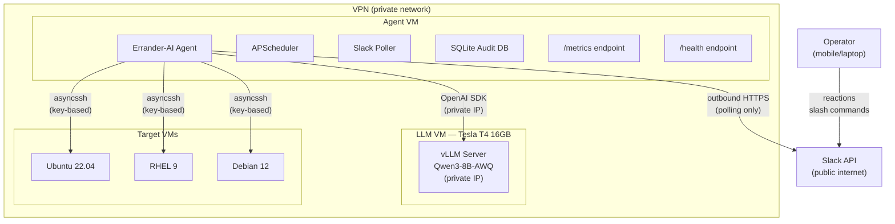

### Constraints

- Agent VM has **no public IP** — fully private
- All Slack communication is **outbound HTTPS** (polling, not webhooks)
- LLM endpoint is a **private IP / internal DNS** inside VPN
- SSH to target VMs is **within the VPN**
- No nginx, no inbound webhooks, no TLS certificates to manage
- The only external dependency is outbound HTTPS to Slack API

### Infrastructure (v1)

- **Agent VM**: Single small VM running the Errander-AI process as a systemd service
- **LLM VM**: Separate VM running vLLM with Qwen3-8B-AWQ (Tesla T4 16GB VRAM, 4 vCPUs, 16GB RAM — already exists)
- **Target VMs**: Existing fleet (already exist)
- **Total new infrastructure**: One VM for the agent
- **No vector database** — PostgreSQL (v2) handles all data storage needs

---

## 3. LangGraph State Machine Design

### Architecture: Parent Orchestrator + Fan-Out + Sub-Graphs

The agent uses a three-level graph structure:

```
Level 1: Batch Orchestrator (parent graph)
  ├── load_config         Load and validate inventory + policies
  ├── validate_targets    SSH reachability + OS verification for all targets
  ├── fan_out             Send() to spawn per-VM graphs in parallel
  ├── collect_results     Aggregate results from all VMs
  └── report              Post summary to Slack, persist to audit DB

Level 2: Per-VM Maintenance Graph (sub-graph, one per target VM)
  ├── discover            SSH in, gather system state
  ├── plan_actions        LLM-powered: prioritize and select actions
  ├── safety_gate         Route based on risk tier + policy
  ├── execute_actions     Loop through planned actions, dispatch to sub-graphs
  ├── audit               Record all results to audit trail
  └── report_vm           Return results to parent

Level 3: Action Sub-Graphs (one per action type)
  ├── validate            Pre-conditions for this specific action
  ├── execute / dry_run   Run the action or simulate it
  ├── verify              Confirm the action succeeded
  └── rollback            Undo on failure (if applicable for this action type)
```

### Why This Structure

- **Multi-VM parallelism is day-one**: `Send()` fan-out processes the fleet concurrently, just like a DevOps engineer would
- **Action isolation**: A bug in docker prune logic cannot affect the patching flow. Separate sub-graphs = separate failure domains
- **Independent testability**: Each sub-graph can be tested without the parent
- **Extensibility**: Adding a new action type = write a sub-graph + register it in the dispatcher

### Graph Flow (Maintenance Run)

```
START
  │
  ▼
load_config ──── validate config, re-read YAML, schema check
  │
  ▼
validate_window ──── check maintenance window, reject if outside (unless --force)
  │
  ▼
validate_targets ──── SSH to each target, verify OS, filter failed targets
  │                    if >50% fail validation → abort entire batch
  ▼
fan_out ──── Send() per healthy VM
  │
  ├──► [VM-1] discover → plan → safety_gate → execute_actions → audit
  ├──► [VM-2] discover → plan → safety_gate → execute_actions → audit
  ├──► [VM-N] ...
  │
  ▼
collect_results ──── aggregate all VM results
  │
  ▼
generate_report ──── LLM-powered Slack summary (or template fallback)
  │
  ▼
post_to_slack ──── post report, start polling for approval reaction
  │
  ▼
approval_gate ──── interrupt() — pause graph, poll Slack for ✅/❌
  │
  ├── ✅ approved → pre_flight_drift_check → execute_live
  ├── ❌ rejected → log rejection → END
  └── ⏰ timeout → auto-reject → END
  │
  ▼
execute_live ──── re-run the graph with dry_run=false using saved plan
  │
  ▼
final_report ──── post completion summary to Slack
  │
  ▼
END
```

### Two-Phase Execution

The graph runs **twice** for every maintenance cycle:

1. **Phase 1 (Dry-Run)**: Full graph execution with `dry_run=true`. Every action simulates but doesn't mutate. Results are saved as a structured maintenance plan (JSON). Report posted to Slack for approval.

2. **Phase 2 (Live)**: On approval, the saved plan is loaded. A pre-flight drift check runs against each VM. If no drift, the graph re-executes with `dry_run=false`, following the saved plan exactly. If drift is detected on any VM, that VM is excluded and a new dry-run + approval cycle is triggered.

---

## 4. State Models

### Batch State (Level 1 — Parent Orchestrator)

```python
class BatchState(TypedDict):
    # Identity
    batch_id: str                           # Unique run identifier
    triggered_by: str                       # "schedule", "slack_command", "manual"
    trigger_details: str                    # e.g., "/errander run --env production"

    # Configuration (loaded at run start)
    dry_run: bool                           # True for phase 1, False for phase 2
    environment: str                        # "production", "staging", "dev"
    policy: Policy                          # resolved policy for this environment
    maintenance_window: MaintenanceWindow | None
    force_override: bool                    # bypasses maintenance window
    force_reason: str | None                # mandatory if force_override=True

    # Targets
    targets: list[VMTarget]                 # from inventory
    healthy_targets: list[VMTarget]         # passed validation
    failed_targets: list[VMTarget]          # failed validation (with reasons)

    # Results (accumulated via reducer)
    vm_results: Annotated[list[VMResult], add]

    # Plan (saved after dry-run for approval)
    maintenance_plan: MaintenancePlan | None

    # Approval
    approval_status: str                    # "pending", "approved", "rejected", "timeout"
    approved_by: str | None                 # Slack user ID
    approval_timestamp: str | None

    # Errors
    error: str | None
    aborted: bool
    abort_reason: str | None
```

### Per-VM State (Level 2 — VM Maintenance Graph)

```python
class VMMaintenanceState(TypedDict):
    # Target identity
    vm_id: str
    host: str
    name: str
    os_family: str                          # "ubuntu", "rhel", "debian"
    os_version: str                         # e.g., "22.04", "9.3"
    environment: str

    # Run config
    dry_run: bool
    policy: Policy
    batch_id: str

    # Discovery results
    system_info: SystemInfo | None          # disk, packages, docker, logs, services
    discovery_timestamp: str | None

    # Planning
    planned_actions: list[PlannedAction]    # ordered by priority
    current_action_index: int

    # Execution results
    action_results: Annotated[list[ActionResult], add]
    rollback_stack: list[RollbackRecord]    # completed actions that can be undone

    # Status
    status: str                             # "discovering", "planning", "executing",
                                            # "completed", "failed", "skipped",
                                            # "needs_manual_intervention"
    error: str | None
    locked: bool                            # VM-level lock acquired
```

### Action Sub-Graph State (Level 3)

```python
class ActionState(TypedDict):
    # Context (from parent)
    vm_id: str
    host: str
    os_family: str
    os_version: str
    dry_run: bool
    policy: Policy

    # Action details
    action_type: str                        # "patching", "docker_prune", etc.
    action_params: dict                     # action-specific parameters
    risk_tier: str                          # "low", "medium", "high", "critical"

    # Pre-execution state (for rollback)
    pre_state: dict | None                  # e.g., package list before patching

    # Execution
    commands_executed: list[CommandRecord]
    output: str
    dry_run_preview: str | None             # what would happen (dry-run mode)

    # Result
    status: str                             # "success", "failed", "skipped", "dry_run_complete"
    error: str | None
    rollback_command: str | None            # how to undo this action
    duration_seconds: float
```

### Supporting Models

```python
class VMTarget(BaseModel):
    host: str                               # IP or hostname
    name: str                               # human-readable name
    os_family: str                          # "ubuntu", "rhel", "debian"
    ssh_user: str
    ssh_key_path: str
    environment: str
    tags: list[str]

class SystemInfo(BaseModel):
    pending_patches: list[PatchInfo]        # package, current_version, available_version, is_security
    disk_usage: list[MountInfo]             # mount_point, total, used, percent
    docker_usage: DockerUsage | None        # images, containers, build_cache, volumes (with sizes)
    log_sizes: list[LogDirInfo]             # path, total_size, largest_file, file_count
    uptime_seconds: int
    os_info: OSInfo                         # distro, version, kernel
    running_services: list[str]
    memory_usage_percent: float
    cpu_usage_percent: float
    last_maintenance: str | None            # timestamp from audit trail

class MaintenancePlan(BaseModel):
    batch_id: str
    created_at: str
    environment: str
    dry_run: bool                           # always True when plan is created
    vm_plans: list[VMPlan]
    total_patches: int
    total_reclaimable_bytes: int
    estimated_duration_seconds: int
    risk_summary: str

class VMPlan(BaseModel):
    vm_id: str
    name: str
    os_family: str
    actions: list[PlannedAction]
    system_info_snapshot: SystemInfo

class PlannedAction(BaseModel):
    action_type: str
    risk_tier: str
    description: str                        # human-readable summary
    commands: list[str]                     # exact commands to run
    dry_run_output: str                     # output from simulation
    rollback_strategy: str                  # "full", "re-pull", "none", "blocked"
    rollback_commands: list[str]            # commands to undo (if applicable)
    estimated_duration_seconds: int
```

---

## 5. Action Types & Sub-Graphs

Each action type is implemented as a standalone LangGraph sub-graph with the common flow:

```
START → validate_preconditions → execute_or_simulate → verify → END
                                        │ (error)
                                     rollback → END
```

### 5.1 Patching (Non-Kernel)

**Risk tier**: Medium

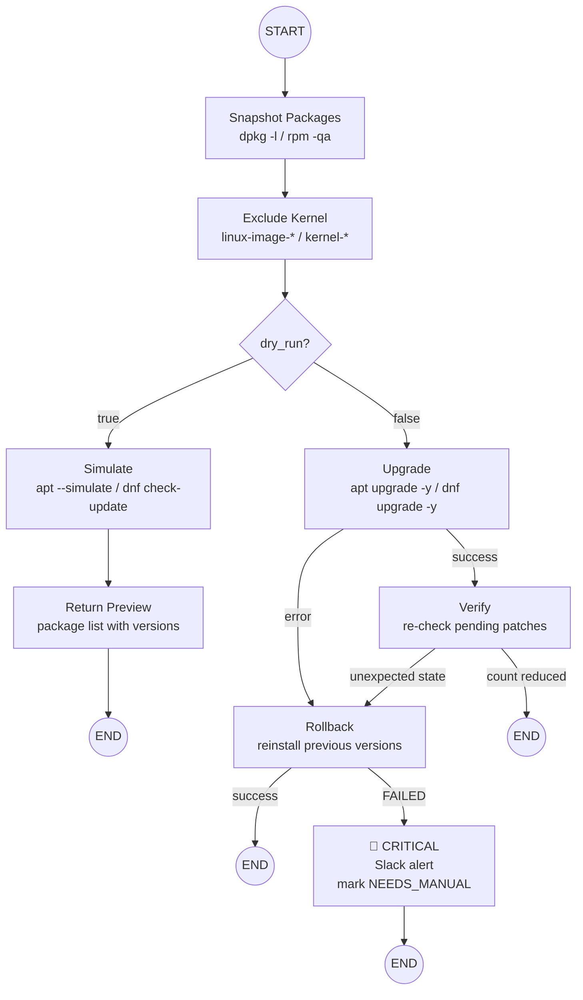

**Dry-run**:
- Ubuntu/Debian: `apt-get --simulate upgrade`
- RHEL: `dnf check-update`
- Output: list of packages with `current_version → new_version`, flag security patches separately

**Live execution**:
1. Snapshot current package list with versions (`dpkg -l` / `rpm -qa`)
2. Exclude kernel packages explicitly (`linux-image-*`, `kernel-*`)
3. Run upgrade (`apt-get upgrade -y` / `dnf upgrade -y --exclude=kernel*`)
4. Verify: re-check pending patches, confirm count reduced

**Rollback tier**: Full
- On failure: reinstall previous versions from snapshot (`apt-get install pkg=version` / `dnf downgrade pkg-version`)
- Batch rollback — all packages rolled back, not selective
- If rollback fails: CRITICAL alert, mark VM as `NEEDS_MANUAL_INTERVENTION`

### 5.2 Docker Prune

**Risk tier**: Low

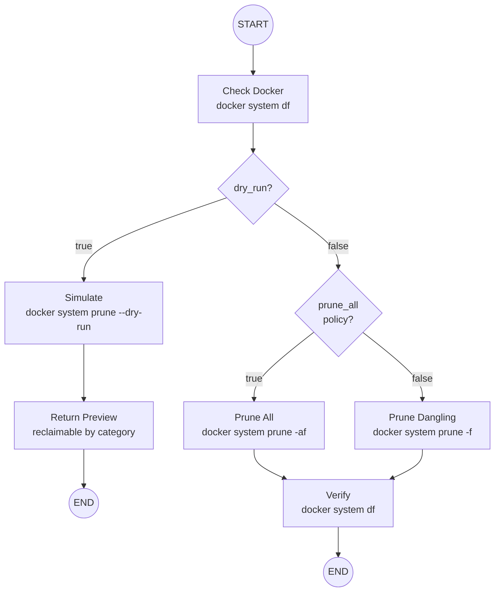

**Dry-run**:
- `docker system df` for current usage
- `docker system prune --all --dry-run` (or `--dry-run` without `--all` depending on policy `docker_prune_all` setting)
- Output: reclaimable space by category (images, containers, build cache)

**Live execution**:
1. Run `docker system prune -f` (dangling only) or `docker system prune -af` (all, including tagged unused images) based on policy
2. Verify: re-run `docker system df`, confirm space reclaimed

**Rollback tier**: Re-Pull
- No true rollback — pruned artifacts are gone
- If critical images were pruned unexpectedly, they can be re-pulled
- Acceptable because prune only removes stopped containers and unused images

### 5.3 Log Rotation

**Risk tier**: Low

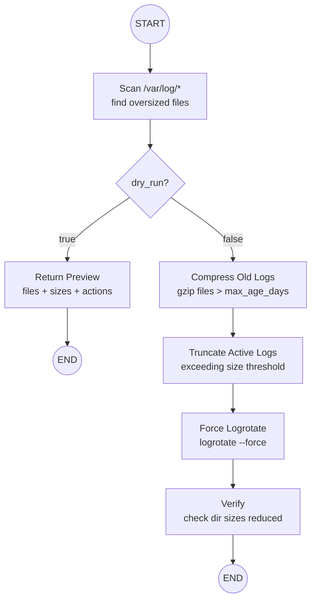

**Dry-run**:
- Scan `/var/log/*` for files exceeding configurable thresholds
- Output: which logs would be rotated, current sizes, rotation action (compress, truncate)

**Live execution**:
1. Compress logs older than `log_rotation_max_age_days` policy value
2. Truncate active log files that exceed size threshold (truncate, don't delete — the service still has the file handle open)
3. Run `logrotate --force` for system-managed logs if configured
4. Verify: check log directory sizes reduced

**Rollback tier**: None needed
- Data still exists, just compressed
- Compressed logs can be decompressed if needed (`gunzip`)
- No data is deleted

### 5.4 Disk Cleanup

**Risk tier**: Low

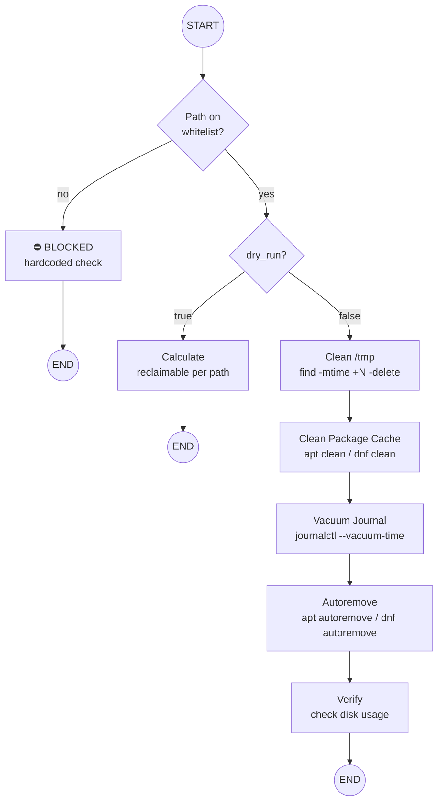

**Dry-run**:
- Check each path on the whitelist, calculate reclaimable space
- Output: per-directory breakdown with sizes

**Live execution** — only these paths, nothing else:
1. `/tmp` — files older than configurable threshold (default 7 days): `find /tmp -type f -mtime +7 -delete`
2. apt/yum cache — `apt-get clean` / `dnf clean all`
3. Journal logs — `journalctl --vacuum-time=<policy_days>d`
4. Orphaned dependencies — `apt-get autoremove -y` / `dnf autoremove -y`
5. Verify: re-check disk usage per mount, confirm reduction

**Rollback tier**: None needed
- Only targets known-safe, ephemeral paths
- Anything not on the whitelist requires human approval to clean

**Whitelist enforcement**: The disk cleanup sub-graph must NEVER execute `rm`, `find -delete`, or any destructive command against a path not on the whitelist. This is a hardcoded check in the validation step, not an LLM decision.

### 5.5 Backup Verification

**Risk tier**: High (requires human approval)

**Dry-run**:
- Check backup location (configurable per VM) for existence and recency
- Output: last backup timestamp, size, age in hours

**Live execution**:
- This is a read-only check even in "live" mode — it verifies backups exist, it doesn't create them
- Flag VMs where backup is older than threshold (e.g., 24 hours)
- Alert if no backup found

**Rollback tier**: N/A (read-only action)

---

## 6. Safety Architecture

### 6.1 Risk Tiers

| Tier | Actions | Approval Behavior |
|---|---|---|
| Low | Disk cleanup, log rotation, Docker prune | Automatic (per policy) |
| Medium | Non-kernel patching, config changes | Policy-dependent (auto in dev, human in prod) |
| High | Service restarts, backup verification | Human approval required |
| Critical | Kernel operations, data deletion | Blocked — never automated |

### 6.2 Policies

Named policies define approval behavior per environment:

```yaml
policies:
  relaxed:                          # dev
    auto_approve: [low, medium, high]
    disk_cleanup_threshold: 70%
    log_rotation_max_age_days: 3
    docker_prune_all: true          # including tagged unused images

  moderate:                         # staging
    auto_approve: [low]
    human_approve: [medium, high]
    disk_cleanup_threshold: 80%
    log_rotation_max_age_days: 7
    docker_prune_all: false         # dangling only

  strict:                           # production
    auto_approve: [low]
    human_approve: [medium, high]
    blocked: [critical]
    disk_cleanup_threshold: 85%
    log_rotation_max_age_days: 14
    docker_prune_all: false
```

### 6.3 Rollback Tiers

| Tier | Actions | Strategy |
|---|---|---|
| Full Rollback | Non-kernel patching | Snapshot full package list before execution. Batch rollback to previous versions on failure. Critical alert if rollback itself fails. |
| Re-Pull | Docker prune | Pruned artifacts are gone. Images can be re-pulled if needed. Accept as low risk. |
| No Rollback Needed | Log rotation, disk cleanup | Data still exists (compressed) or was ephemeral (safe whitelist paths). |
| Never Touch | Kernel, active data dirs | Blocked at the safety gate. Never reaches execution. |

### 6.4 Safety Gate Flow

```
action planned
      │
      ▼
 risk_tier = ?
      │
      ├── critical → BLOCKED. Log reason. Skip action.
      │
      ├── high → check policy
      │            ├── auto_approve includes "high" → proceed
      │            └── human_approve includes "high" → interrupt() for approval
      │
      ├── medium → check policy
      │            ├── auto_approve includes "medium" → proceed
      │            └── human_approve includes "medium" → include in approval report
      │
      └── low → check policy
                 └── auto_approve includes "low" → proceed (always true)
```

Note: In the two-phase execution model, the safety gate during dry-run classifies and reports risk. The actual approval happens at the batch level between phases via Slack.

### 6.5 VM-Level Locking

- Before any operation on a VM, the agent acquires a file-based lock
- Lock file: `/var/run/errander/<vm_name>.lock` on the agent VM
- Lock contains: `batch_id`, `acquired_at`, `acquired_by`
- TTL: 2 hours — if the agent crashes, stale locks expire automatically
- If lock is already held: skip that VM, report "VM is currently under maintenance by another run"
- V2: Redis-based distributed locking for multi-agent setups

### 6.6 Disk Cleanup Whitelist

Hardcoded and enforced in the validation step of the disk cleanup sub-graph:

- `/tmp` (files older than configurable threshold)
- apt/yum package cache (`/var/cache/apt`, `/var/cache/dnf`)
- Journal logs (via `journalctl --vacuum-time`)
- Orphaned package dependencies (via `autoremove`)

**Anything not on this whitelist requires human approval to clean.** The whitelist check is a hardcoded validation, not an LLM decision.

---

## 7. SSH Execution Layer

### 7.1 Library and Connection Management

- **Library**: `asyncssh` (async-native, fits async-first architecture)
- **Auth**: Key-based only. Never passwords. Key paths declared in inventory config.
- **Connection pooling**: Persistent connections per VM for the duration of a maintenance run. One connection opened at validation time, reused for discovery, planning, and execution, closed at run end.
- **Reconnection**: If a connection drops mid-operation, retry 3 times with exponential backoff (5s, 15s, 45s). If reconnection fails, mark the VM as FAILED.

### 7.2 OS Detection (Hybrid)

**Step 1 — Config-declared** (fast, pre-flight):
- Each target declares `os_family` in inventory YAML
- Used for pre-flight validation and command selection before SSH

**Step 2 — Runtime verification** (authoritative):
- On first SSH connection, parse `/etc/os-release`
- Extract `ID` (ubuntu, rhel, debian) and `VERSION_ID`
- Compare against config-declared `os_family`
- **Mismatch**: Flag the discrepancy, skip that VM, report to operator. Do not proceed with potentially wrong commands.

### 7.3 Command Abstraction (Strategy Pattern)

```python
class PackageManager(Protocol):
    async def list_pending_updates(self, conn: SSHConnection) -> list[PatchInfo]: ...
    async def simulate_upgrade(self, conn: SSHConnection) -> str: ...
    async def execute_upgrade(self, conn: SSHConnection, exclude: list[str]) -> str: ...
    async def snapshot_packages(self, conn: SSHConnection) -> list[PackageVersion]: ...
    async def rollback_packages(self, conn: SSHConnection, snapshot: list[PackageVersion]) -> str: ...

class AptManager(PackageManager):
    """Ubuntu and Debian"""
    ...

class DnfManager(PackageManager):
    """RHEL 8+ and Fedora"""
    ...
```

The correct manager is selected based on verified `os_family` after runtime OS detection.

### 7.4 Command Execution

All commands run through a single `execute_command` function that:
1. Logs the command to the audit trail **before** execution
2. Executes via SSH with a configurable timeout (default 300 seconds per command)
3. Captures stdout, stderr, and exit code
4. Logs the result to the audit trail **after** execution
5. Returns a structured `CommandRecord`

```python
class CommandRecord(BaseModel):
    command: str
    exit_code: int
    stdout: str
    stderr: str
    started_at: str
    completed_at: str
    duration_seconds: float
    vm_id: str
```

The LLM never touches SSH directly. All connectivity is handled by the Python execution layer.

---

## 8. Dry-Run / Live Execution Flow

### The Terraform Plan/Apply Pattern

Every maintenance cycle follows this two-phase flow:

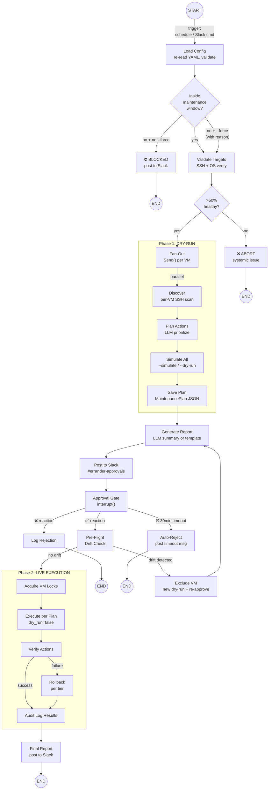

### Dry-Run Detail per Action Type

| Action | Dry-Run Command | Output Detail |
|---|---|---|
| Patching | `apt-get --simulate upgrade` / `dnf check-update` | List of packages: name, current_version → new_version, security flag |
| Docker Prune | `docker system df` + `docker system prune --dry-run` | Reclaimable space by category: images, containers, build cache |
| Disk Cleanup | `du -sh` on each whitelist path | Per-directory breakdown with sizes |
| Log Rotation | `find /var/log -size +<threshold>` | Which logs, current sizes, what would happen |

### Pre-Flight Drift Check

Before live execution, the agent re-runs discovery on each VM and compares against the snapshot saved during dry-run:

- **Package list changed**: Someone manually installed/updated packages
- **Disk usage changed significantly**: Files created or deleted
- **Docker state changed**: Images pulled or containers started
- **New services running**: Something deployed since dry-run

**Any drift = new approval required.** The original approval was for a specific plan. Changed state means changed plan means new approval cycle. Drift could also mean someone is actively working on the VM — the agent must not interfere.

On drift detection, the agent:
1. Excludes the drifted VM from the current live execution
2. Auto-triggers a new dry-run for that VM
3. Posts to Slack: "⚠️ State drift detected on web-prod-01 since last dry-run. Here's the updated plan — please re-approve."

---

## 9. Approval Mechanism

### Flow (Slack Reaction Polling)

```
Agent                           Slack                          Operator
  │                               │                               │
  │── POST message to channel ──►│                               │
  │   (maintenance plan report)   │                               │
  │                               │── notification ──────────────►│
  │                               │                               │
  │◄── GET reactions (poll) ──────│                               │
  │   (every 30 seconds)         │                               │
  │                               │◄── ✅ or ❌ reaction ─────────│
  │◄── GET reactions (poll) ──────│                               │
  │   (sees ✅ reaction)          │                               │
  │                               │                               │
  │── resume graph ──────────────►│                               │
  │   Command(resume="approved")  │                               │
  │                               │                               │
  │── POST follow-up message ───►│                               │
  │   ("✅ Approved by @user")    │                               │
```

### Implementation Details

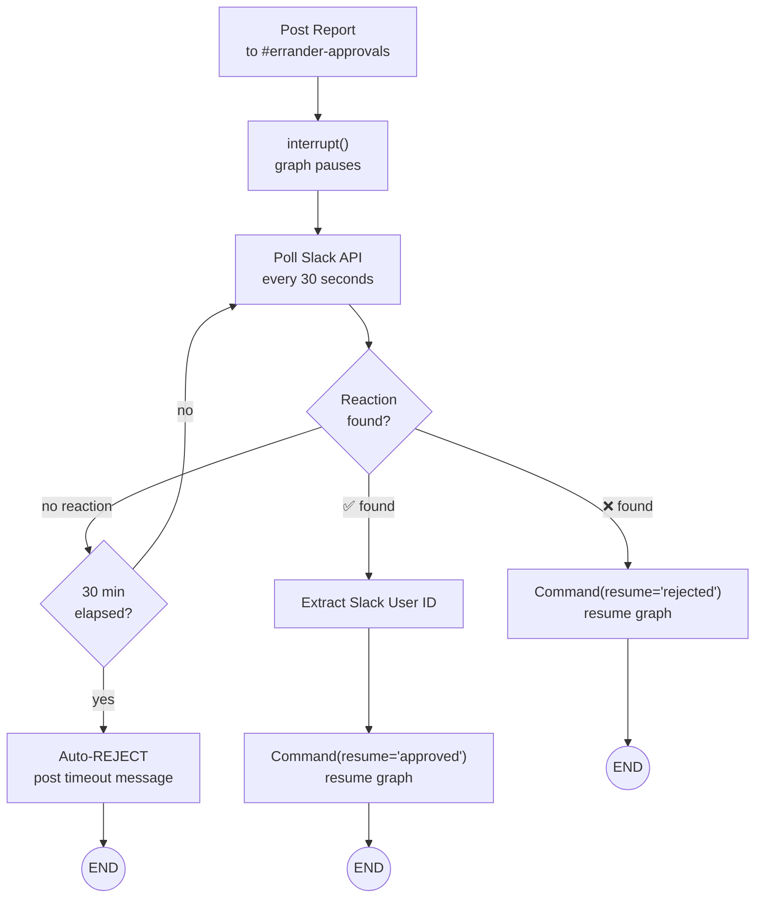

1. Agent completes dry-run, generates `MaintenancePlan`
2. LLM generates readable Slack summary (or template fallback)
3. Agent posts report to `#errander-approvals` channel via Slack API
4. LangGraph `interrupt()` pauses the graph, saves checkpoint
5. Agent polls `conversations.reactions` API every 30 seconds
6. On ✅ reaction: extract Slack user ID, resume with `Command(resume="approved")`
7. On ❌ reaction: resume with `Command(resume="rejected")`
8. On timeout (30 minutes, configurable): auto-REJECT, post follow-up: "⏰ Maintenance plan timed out — no approval received. Skipped."

### Slack Message Format

One consolidated message per batch (not per-VM):

```
🔧 Errander-AI Maintenance Plan — Sat Mar 22, 02:00 UTC
━━━━━━━━━━━━━━━━━━━━━━━━━━━━

📊 Summary: 8 VMs | 47 patches | 12.4 GB reclaimable
Estimated duration: ~35 minutes
Risk: LOW (all actions auto-approvable by policy except
2 medium-risk patching operations)

Per-VM highlights:
🟡 web-prod-01 (Ubuntu 22.04)
   14 patches (3 security) · Docker 4.2 GB · Logs 2.4 GB

🟢 web-prod-02 (Ubuntu 22.04)
   8 patches · Disk cleanup 1.1 GB

🟡 db-prod-01 (RHEL 9)
   6 patches (1 security) · Docker 2.8 GB

🟢 [+5 more VMs — all low-risk, routine]

━━━━━━━━━━━━━━━━━━━━━━━━━━━━
React ✅ to approve ALL | ❌ to reject ALL
Full details: [link to audit log]
Timeout: auto-reject in 30 minutes
━━━━━━━━━━━━━━━━━━━━━━━━━━━━
```

### Design Constraints

- **All-or-nothing approval (v1)**: One reaction approves/rejects the entire batch. To exclude specific VMs, reject and re-trigger with `--exclude`
- **Message size**: Keep under 3000 characters (Slack limit is 4000, leave buffer). If >5 VMs, summarize extras as "[+N more VMs]" with link to full report
- **Mobile-friendly**: Operators review on mobile. The message is for decision-making, not forensics. Full details live in the audit log.
- **V2**: Per-VM approval via Slack thread replies

### Slash Commands (On-Demand Triggers)

```
/errander run web-prod-*                    # by hostname pattern
/errander run --env staging                 # by environment
/errander run db-prod-01 --actions patching,docker_prune  # specific actions
/errander run --env production --exclude db-prod-01       # exclude VMs
/errander run --env production --force --reason "emergency security patch"  # bypass window
/errander status                            # current/recent runs
```

The Slack bot validates the command, triggers a dry-run, and follows the standard approval flow.

---

## 10. LLM Integration

### Provider Setup

- **Model**: Qwen3-8B-AWQ (Apache 2.0 license, official HuggingFace weights)
- **Inference server**: vLLM on dedicated VM with Tesla T4 16GB VRAM, 4 vCPUs, 16GB RAM
- **Serve command**: `vllm serve Qwen/Qwen3-8B-AWQ --enable-reasoning --reasoning-parser deepseek_r1 --enable-auto-tool-choice --tool-call-parser hermes --max-model-len 8192 --gpu-memory-utilization 0.85`
- **API**: OpenAI-compatible (`/v1/chat/completions`) on private IP inside VPN
- **Client**: OpenAI Python SDK pointed at configurable `ERRANDER_LLM_BASE_URL`
- **Thinking modes**: Thinking mode (reasoning enabled) for planning + failure analysis. `/no_think` prefix for report generation (faster, no reasoning overhead).
- **Response format**: All LLM responses are structured JSON, parsed and validated via Pydantic models. No free-text responses.
- **Timeout**: 60 seconds per call (T4 is slower than cloud APIs)
- **Concurrency**: Sequential LLM calls preferred — T4 has limited VRAM, concurrent requests risk OOM or degraded latency. vLLM handles batching natively but the agent should not fire parallel requests.
- **Upgrade path**: Qwen3.5-9B-AWQ when official weights and stable vLLM support are available

The client code works unchanged if swapped to a public API (OpenAI, Anthropic via proxy, etc.).

### LLM-Powered Functions (v1)

#### 1. Action Planning & Prioritization

**LLM mode**: Thinking (reasoning enabled — complex tradeoff weighing)

**Input**: SystemInfo from discovery (disk usage, pending patches, Docker space, log sizes, CPU/memory, running services)

**Output**: Structured JSON → parsed into ordered list of `PlannedAction` with priorities and reasoning

**What the LLM decides**:
- Which actions to run on this VM given current state
- Execution order (e.g., disk cleanup before patching if disk is nearly full, to ensure enough space for package downloads)
- Whether to flag unusual conditions (e.g., abnormally high disk usage, too many pending patches suggesting the VM has been neglected)

**Fallback**: Hardcoded default priority order:
1. Disk cleanup (if above threshold)
2. Log rotation (if above threshold)
3. Docker prune (if Docker installed and space reclaimable)
4. Patching (if patches available)
5. Backup verification

#### 2. Failure Analysis

**LLM mode**: Thinking (reasoning enabled — needs to interpret error patterns)

**Input**: Failed command output (stdout, stderr, exit code), action context

**Output**: Structured JSON → decision: retry, rollback, skip, or escalate

**What the LLM decides**:
- Is this a transient error (retry) or permanent (rollback/escalate)?
- Is the error output suggesting a known issue pattern?
- What context should the human receive if escalated?

**Fallback**: Conservative hardcoded logic — on any failure, attempt rollback (if applicable), then escalate to human.

#### 3. Report Generation

**LLM mode**: `/no_think` (no reasoning — straightforward text generation, faster)

**Input**: Raw dry-run data, system info, action results

**Output**: Formatted Slack message (markdown)

**What the LLM decides**:
- How to summarize complex data concisely for mobile viewing
- What to highlight vs what to collapse
- Human-readable descriptions of technical actions

**Fallback**: Template-based report using string formatting. Less readable but functional.

### LLM Boundaries (Hardcoded, No LLM)

- OS detection and command selection (strategy pattern)
- Risk tier classification (static policy table: action type → tier)
- Safety gates and approval routing (policy → approval path)
- Rollback execution (deterministic per action type)
- Metric emission and audit logging
- Whitelist enforcement for disk cleanup
- Scheduling and maintenance window checks

### LLM Availability Guarantee

Every LLM call must have a timeout and fallback:

```python
async def call_llm(
    messages: list[dict],
    response_model: type[BaseModel],
    thinking: bool = True,
    timeout: float = 60.0,
) -> BaseModel | None:
    """Call the LLM with structured output. Returns None on failure (caller uses fallback)."""
    try:
        # Prepend /no_think to user message if thinking disabled
        if not thinking:
            messages = prepend_no_think(messages)

        response = await asyncio.wait_for(
            llm_client.chat.completions.create(
                model=settings.llm_model,
                messages=messages,
                response_format={"type": "json_object"},
            ),
            timeout=timeout,
        )
        return response_model.model_validate_json(response.choices[0].message.content)
    except (asyncio.TimeoutError, ConnectionError, Exception) as e:
        log.warning("LLM unavailable, falling back to hardcoded logic", error=str(e))
        return None  # caller uses fallback
```

**The agent must NEVER be blocked by LLM unavailability.** The LLM is self-managed infrastructure without SLAs. The agent degrades gracefully to hardcoded defaults.

### V2 LLM Functions (Deferred)

- Anomaly detection (unusual patterns in system state)
- Learning from historical runs to improve planning
- Natural language querying of audit trail

---

## 11. Scheduling & Maintenance Windows

### Scheduler

- **Library**: APScheduler (Python-native, lightweight)
- **Integration**: Built into the agent process. The agent owns its own schedule — no external cron or systemd timers.
- **Persistence**: APScheduler job store in SQLite (same DB as audit trail) so scheduled jobs survive restarts

### Schedule Configuration

```yaml
schedules:
  production:
    maintenance: "0 2 * * 6"      # Saturday 2am UTC (cron syntax)
    discovery: "0 6 * * *"         # Daily 6am UTC
  staging:
    maintenance: "0 0 * * *"       # Daily midnight UTC
    discovery: "0 6 * * *"         # Daily 6am UTC
  dev:
    maintenance: null               # on-demand only
    discovery: "0 6 * * *"         # Daily 6am UTC
```

### Maintenance Windows (Agent-Enforced)

```yaml
environments:
  production:
    maintenance_window: "02:00-06:00 UTC"
    maintenance_days: [saturday]
  staging:
    maintenance_window: "00:00-06:00 UTC"
    maintenance_days: [daily]
  dev:
    maintenance_window: null        # no restrictions
```

- If a scheduled or on-demand run targets an environment outside its maintenance window, the agent **blocks it**
- Posts to Slack: "⛔ Maintenance for prod targets is only allowed Sat 02:00-06:00 UTC. Current time is outside the window."
- **Emergency override**: `--force` flag via Slack command. Requires a `--reason` parameter. Both are logged prominently in the audit trail.

### Discovery Scans vs Maintenance Runs

| | Discovery Scan | Maintenance Run |
|---|---|---|
| Frequency | Daily | Per-environment schedule or on-demand |
| Mutates VMs | Never (read-only) | Yes (in live phase) |
| Requires approval | No | Yes |
| Output | Slack summary + audit DB | Slack report + approval flow + audit DB |
| Purpose | Visibility ("what needs attention") | Action ("fix what needs attention") |

---

## 12. Discovery Scans

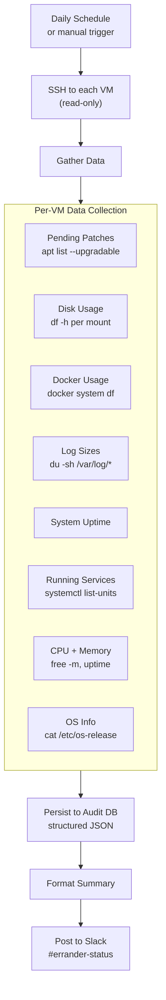

### Data Collected Per VM

| Category | Data Points |
|---|---|
| Pending patches | Count, full list with current → available version, security patches flagged |
| Disk usage | Per mount point: total, used, percent. Compare against policy threshold. |
| Docker | Breakdown by images, containers, build cache, volumes — with sizes per category |
| Log sizes | `/var/log/*` per-directory breakdown. Flag any single file > configurable size (default 1GB) |
| Uptime | Seconds since last reboot |
| Last maintenance | Timestamp and summary from audit trail |
| OS info | Distro, version, kernel version (for fleet consistency tracking) |
| Running services | List of active systemd services (context for LLM planning) |
| Memory/CPU | Current usage snapshot (identify VMs under load — skip or defer maintenance) |

### Scan Output

**Slack** (`#errander-status` channel) — daily summary, concise, per-VM:

```
📊 Daily Scan — Wed Mar 19, 06:00 UTC
━━━━━━━━━━━━━━━━━━━━━━━━━━━━

🟡 web-prod-01: disk at 82% (threshold 85%), 14 patches
   pending (3 security), Docker 8.2 GB reclaimable
🟢 db-prod-01: all clear, last maintained 3 days ago
🔴 web-prod-03: disk at 93% — above threshold!
   23 patches pending (7 security), no maintenance in 14 days

Summary: 3 VMs scanned, 1 needs immediate attention
Next scheduled maintenance: Sat Mar 22 02:00 UTC
```

**Audit DB**: Full scan data as structured JSON. Enables trending over time — disk usage growing? Patches piling up? Docker waste accumulating? The LLM can reference historical scans when planning maintenance.

---

## 13. Configuration & Inventory

### Inventory File (`config/inventory.yaml`)

```yaml
environments:
  production:
    maintenance_window: "02:00-06:00 UTC"
    maintenance_days: [saturday]
    approval_policy: strict
    ssh_user: errander
    ssh_key_path: ~/.ssh/errander_prod
    targets:
      - host: 10.0.1.10
        name: web-prod-01
        os_family: ubuntu
        tags: [web, frontend]
      - host: 10.0.1.20
        name: db-prod-01
        os_family: rhel
        tags: [database]
        ssh_user: errander-db      # overrides group-level

  staging:
    maintenance_window: "00:00-06:00 UTC"
    maintenance_days: [daily]
    approval_policy: moderate
    ssh_user: errander
    ssh_key_path: ~/.ssh/errander_staging
    targets:
      - host: 10.0.2.10
        name: web-stg-01
        os_family: ubuntu
        tags: [web]

  dev:
    maintenance_window: null
    maintenance_days: [daily]
    approval_policy: relaxed
    ssh_user: errander
    ssh_key_path: ~/.ssh/errander_dev
    targets:
      - host: 10.0.3.10
        name: web-dev-01
        os_family: debian
        tags: [web]
```

### Policy Definitions (`config/policies.yaml`)

```yaml
policies:
  relaxed:
    auto_approve: [low, medium, high]
    disk_cleanup_threshold: 70
    log_rotation_max_age_days: 3
    log_max_file_size_mb: 500
    docker_prune_all: true
    tmp_cleanup_age_days: 3
    journal_vacuum_days: 3

  moderate:
    auto_approve: [low]
    human_approve: [medium, high]
    disk_cleanup_threshold: 80
    log_rotation_max_age_days: 7
    log_max_file_size_mb: 1000
    docker_prune_all: false
    tmp_cleanup_age_days: 7
    journal_vacuum_days: 7

  strict:
    auto_approve: [low]
    human_approve: [medium, high]
    blocked: [critical]
    disk_cleanup_threshold: 85
    log_rotation_max_age_days: 14
    log_max_file_size_mb: 1000
    docker_prune_all: false
    tmp_cleanup_age_days: 14
    journal_vacuum_days: 14
```

### Settings (`config/settings.yaml`)

```yaml
agent:
  approval_timeout_seconds: 1800        # 30 minutes
  ssh_command_timeout_seconds: 300       # 5 minutes per command
  ssh_reconnect_attempts: 3
  ssh_reconnect_backoff: [5, 15, 45]    # seconds
  fleet_failure_threshold: 0.5          # abort if >50% targets fail validation
  vm_lock_ttl_seconds: 7200             # 2 hours
  graceful_shutdown_timeout_seconds: 120

slack:
  approvals_channel_env: ERRANDER_SLACK_CHANNEL_ID
  status_channel: errander-status      # for discovery scans
  poll_interval_seconds: 30

llm:
  timeout_seconds: 30
  max_retries: 2

schedules:
  production:
    maintenance: "0 2 * * 6"
    discovery: "0 6 * * *"
  staging:
    maintenance: "0 0 * * *"
    discovery: "0 6 * * *"
  dev:
    maintenance: null
    discovery: "0 6 * * *"
```

### Config Inheritance

Host-level settings override group-level (environment). Group-level overrides global defaults.

```
Global defaults → Environment settings → Host-specific overrides
```

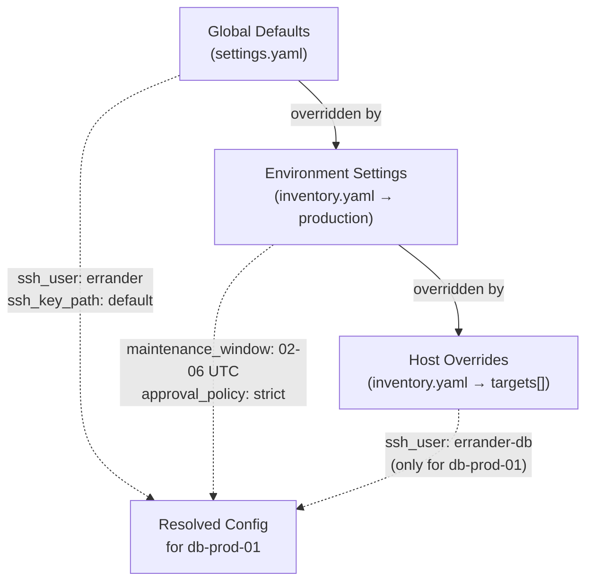

### Config Hot-Reload

- Agent re-reads config at the **start of every run** (scheduled or on-demand)
- Validates against a YAML schema before applying
- If the updated YAML is malformed: keep last-known-good config, post warning to Slack
- No file-watcher or mid-run reload — changes take effect on the **next run**, not the current one

### Secrets (Environment Variables — v1)

```
ERRANDER_SLACK_BOT_TOKEN      # posting messages + polling reactions
ERRANDER_SLACK_CHANNEL_ID     # dedicated approvals channel
ERRANDER_LLM_BASE_URL         # private vLLM endpoint (e.g., http://10.0.0.5:8000/v1)
ERRANDER_LLM_API_KEY          # if vLLM requires auth (may be empty)
ERRANDER_AUDIT_DB_URL         # SQLite path (e.g., /var/lib/errander/audit.sqlite)
```

SSH keys: referenced by file path in inventory config, never inlined. Agent validates all key paths are readable at startup.

`.gitignore` must include: `.env`, `*.pem`, `*.key`, `*.sqlite`

---

## 14. Observability

### Prometheus Metrics (v1)

| Metric | Type | Labels | Alert On |
|---|---|---|---|
| `errander_actions_total` | Counter | `action`, `vm`, `status`, `risk_tier` | `status="failure"` |
| `errander_action_duration_seconds` | Histogram | `action`, `vm` | Significantly above baseline |
| `errander_ssh_connection_failures_total` | Counter | `vm` | Any increment (immediate alert) |
| `errander_rollback_total` | Counter | `action`, `vm`, `status` | Any rollback, especially `status="failure"` |

Exposed at `/metrics` endpoint on the agent process.

### V2 Metrics (Deferred)

- `errander_approval_wait_seconds` — time waiting for human approval
- `errander_dry_run_drift_detected_total` — state drift between dry-run and live execution

### Operational Logs

- **Format**: Structured JSON to stdout
- **Consumer**: Docker log collection, journald, or any stdout-based log aggregator
- **Retention**: 30 days (rotatable)
- **Levels**: DEBUG, INFO, WARNING, ERROR
- **Content**: Agent internals — SSH connected, command executed, retry happened, config loaded, scheduler fired

```json
{
  "timestamp": "2026-03-22T02:15:03.412Z",
  "level": "INFO",
  "module": "execution.ssh",
  "message": "Command executed",
  "vm_id": "web-prod-01",
  "command": "apt-get --simulate upgrade",
  "exit_code": 0,
  "duration_seconds": 2.3,
  "batch_id": "batch-20260322-020000"
}
```

### Audit Trail

- **Separate stream** from operational logs
- **Purpose**: Compliance — immutable record of every action taken on every VM
- **Storage**: Dedicated audit log file AND SQLite database (v1), PostgreSQL (v2)
- **Retention**: Indefinite

Each audit event contains:

```json
{
  "event_id": "uuid",
  "timestamp": "2026-03-22T02:15:03.412Z",
  "batch_id": "batch-20260322-020000",
  "vm_id": "web-prod-01",
  "vm_name": "web-prod-01",
  "action_type": "patching",
  "risk_tier": "medium",
  "phase": "live",
  "status": "success",
  "approved_by": "U12345678",
  "approved_at": "2026-03-22T02:05:00Z",
  "before_state": { "pending_patches": 14 },
  "after_state": { "pending_patches": 0 },
  "commands_executed": [
    {
      "command": "apt-get upgrade -y",
      "exit_code": 0,
      "duration_seconds": 45.2
    }
  ],
  "duration_seconds": 48.7,
  "rollback_triggered": false,
  "error": null
}
```

### Health Endpoint

`GET /health` returns:

```json
{
  "status": "healthy",
  "uptime_seconds": 84523,
  "last_discovery_scan": "2026-03-19T06:00:00Z",
  "last_maintenance_run": "2026-03-15T02:15:00Z",
  "last_maintenance_status": "completed",
  "active_run": null,
  "scheduler_next_run": "2026-03-22T02:00:00Z",
  "version": "0.1.0"
}
```

Used by systemd watchdog (agent pings every 30 seconds, restart after 3 missed pings) and external uptime checkers.

---

## 15. Error Handling & Edge Cases

### VM Unreachable Mid-Operation

1. Retry SSH connection 3 times with exponential backoff (5s, 15s, 45s)
2. If reconnection succeeds: re-run discovery to determine actual state. Compare against plan. Continue with remaining actions or report partial completion.
3. If reconnection fails: mark VM as `FAILED`. Log everything completed, in-progress, and remaining. Send immediate Slack alert with full context. Do NOT attempt rollback on an unreachable VM.
4. **Fully isolated** from other VMs. Other targets continue unaffected.

### Partial Fleet Failure

- **Default**: Proceed with healthy VMs, skip failed ones, report all failures.
- **Safety threshold**: If >50% of targets fail validation, abort the entire batch. This likely indicates a systemic issue (network, credentials, DNS), not individual VM problems.
- Threshold configurable via `fleet_failure_threshold` in settings.
- Every skipped VM gets logged with the specific failure reason.

### Drift After Approval

- Drift detected = **new approval required. Always. No exceptions.**
- The original approval was for a specific plan. Changed state = changed plan = new approval cycle.
- Drift could mean someone is actively working on that VM — the agent must not interfere.
- Agent auto-triggers a new dry-run and posts a new Slack report: "⚠️ State drift detected on web-prod-01 since last dry-run. Here's the updated plan — please re-approve."

### Rollback Failure

- **CRITICAL severity**. No retries on failed rollback.
- Immediately escalate via Slack with: original action, what failed, what the rollback attempted, why the rollback failed, and the likely current state of the VM.
- Mark VM as `NEEDS_MANUAL_INTERVENTION`.
- Agent moves on to other VMs but this VM is **locked out of future automated maintenance** until a human clears the flag.

### Concurrent Maintenance

- **VM-level locking** before any operation. File-based lock for v1.
- Lock file: `/var/run/errander/<vm_name>.lock` on agent VM
- Lock contents: `batch_id`, `acquired_at`, `acquired_by`
- If lock already held: skip VM, report "VM is currently under maintenance by another run"
- **TTL**: 2 hours. Prevents stale locks from permanently blocking a VM if the agent crashes.

### General Error Philosophy

- **Fail LOUD, fail FAST, fail SAFE**
- Never silently swallow errors
- When in doubt, stop and escalate to human
- Every failure state must leave the VM in a known, documented condition — never in an ambiguous state
- Every error is logged to both operational logs and audit trail

---

## 16. Agent Lifecycle

### Startup Sequence

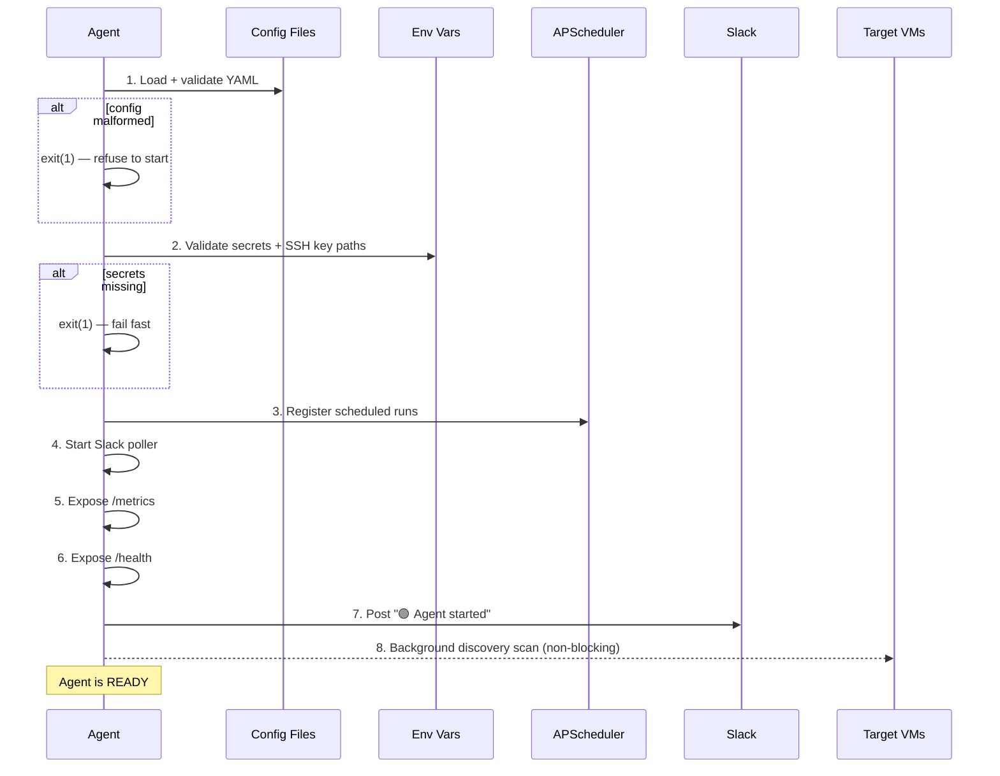

1. Load and validate config (parse YAML, schema check). **If config is malformed, refuse to start** — log error and exit with non-zero code.
2. Validate secrets (all required env vars present, SSH key paths exist and are readable). **Fail-fast** if anything missing.
3. Start APScheduler (register scheduled maintenance and discovery runs)
4. Start Slack poller (begin polling for approval reactions and slash commands)
5. Expose `/metrics` endpoint (Prometheus)
6. Expose `/health` endpoint
7. Log "Errander-AI agent ready" to operational log
8. Post startup message to Slack: "🟢 Errander-AI agent started. Next scheduled run: [time]"
9. Trigger a **non-blocking** discovery scan in background — agent is "ready" and accepting commands while scan runs. Post results to Slack when complete.

No SSH reachability check at startup. SSH validation happens at the start of each run. This avoids slow startup when targets are unreachable.

### Graceful Shutdown (SIGTERM)

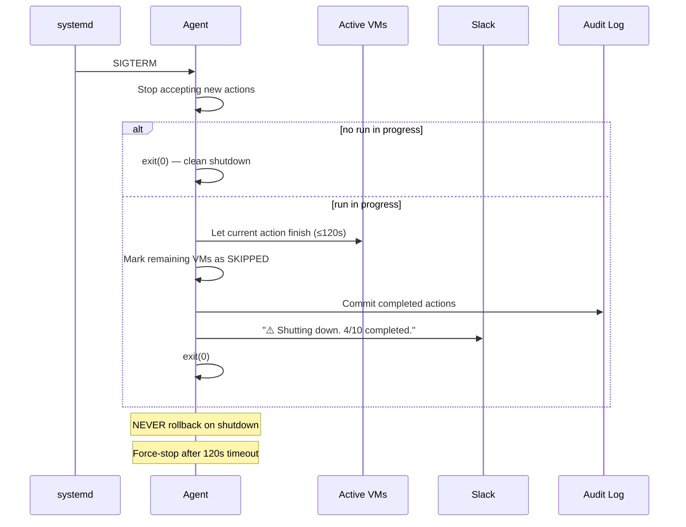

If **no maintenance run** is in progress: shut down immediately.

If a maintenance run **is** in progress:
1. Stop accepting new actions (don't start next VM in queue)
2. Let the currently executing action on each active VM **finish** (don't abort mid-package-install)
3. Mark remaining unprocessed VMs as `SKIPPED` with reason "agent shutdown"
4. Commit audit log for everything completed
5. Post to Slack: "⚠️ Errander-AI shutting down. Completed maintenance on 4/10 VMs. Remaining 6 skipped."
6. Exit cleanly

**NEVER rollback on graceful shutdown.** Completed actions stay completed.

**Timeout**: If current action doesn't finish within 120 seconds of SIGTERM, force-stop and mark that VM as `INTERRUPTED`.

### Crash Recovery

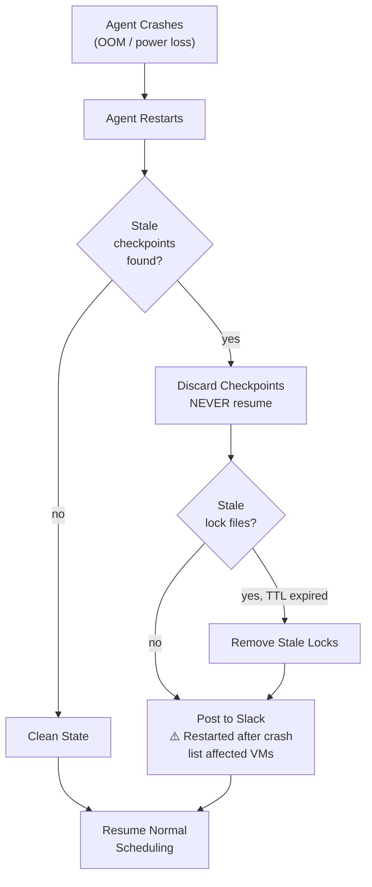

On restart after unexpected termination:
1. Detect stale LangGraph checkpoints from the crashed run
2. **Discard them. NEVER resume interrupted runs.** VM state may have changed during downtime.
3. Post to Slack: "⚠️ Errander-AI restarted after unexpected shutdown. Previous run was interrupted — [X] VMs may have partial maintenance. Manual review recommended."
4. List which VMs were in-progress at crash time
5. Clean up stale lock files (check TTL)
6. Resume normal scheduling from clean state

### Health Monitoring

- `/health` endpoint: JSON response with status, uptime, last runs, next scheduled run
- **systemd watchdog**: Agent pings systemd every 30 seconds. If 3 consecutive pings are missed, systemd restarts the agent.
- External monitoring via `/health` endpoint (UptimeRobot, Prometheus blackbox exporter, etc.)

---

## 17. Testing Strategy

### Unit Tests (Mandatory for Every Module)

- **Mock**: asyncssh, LLM (vLLM responses), Slack API
- **Test each node's logic in isolation**: patching, docker prune, disk cleanup, log rotation, rollback
- **Command abstraction**: AptManager produces correct commands, DnfManager produces correct commands, for each operation
- **Policy evaluation**: given config + risk tier → correct approval path
- **Config parsing**: malformed YAML handled gracefully, inheritance works correctly, schema validation catches errors
- **Framework**: pytest + pytest-asyncio
- **Coverage focus**: `safety/` and `agent/subgraphs/` — bugs here are most dangerous

### Graph Tests (Mandatory)

- **Test the LangGraph state machine in isolation** — no real infrastructure
- **Routing**: Given state X, does the graph route to the correct next node?
- **Interrupt/resume**: Does the approval gate pause and resume correctly with approve/reject/timeout?
- **Error paths**: SSH failure mid-graph, LLM timeout, partial fleet failure — correct graph behavior for each
- **State transitions**: Does state carry the right data through each node? Do reducers aggregate correctly?
- **Two-phase flow**: Does dry-run produce a valid plan? Does live execution follow the plan?

### Integration Tests (Pragmatic for v1)

- **Dry-run against real staging VMs**: Safe because dry-run is read-only and non-destructive. Validates SSH connectivity, OS detection, command generation, and full graph flow.
- **Mock vLLM responses** with canned fixtures for deterministic tests. Hit real vLLM only in manual testing — LLM is non-deterministic and causes flaky tests.
- **Mock Slack API** responses for the posting/polling flow.

### Not in v1

- Throwaway VMs (Vagrant/Docker mimicking target OSes) — overkill for now
- Automated full end-to-end live-run tests — too risky to automate. Validated manually on staging first.

---

## 18. V2 Upgrade Path

These are explicitly deferred from v1 but the v1 architecture should make them easy to add:

| Feature | V1 | V2 |
|---|---|---|
| Audit storage | SQLite (designed for PostgreSQL from day one) | PostgreSQL |
| VM locking | File-based (single agent VM) | Valkey (BSD-licensed Redis fork, distributed) |
| Secrets | Environment variables | HashiCorp Vault |
| Approval | Slack reaction polling | Slack webhooks via nginx reverse proxy (lower latency) |
| Approval granularity | All-or-nothing per batch | Per-VM approval via Slack thread replies |
| Approval queues | In-process | Valkey-backed async queues |
| Dashboard | None (Slack + audit log) | React/Next.js, hosted anywhere, reads from PostgreSQL via thin API |
| LLM model | Qwen3-8B-AWQ | Qwen3.5-9B-AWQ (when official weights + stable vLLM available) |
| LLM: anomaly detection | Not implemented | Flag unusual patterns in system state |
| LLM: learning | Not implemented | Improve planning based on historical run outcomes |
| Metrics | 4 core metrics | `approval_wait_seconds`, `drift_detected_total` |
| Multi-agent | Single agent VM | Multiple agents with distributed coordination |

### Abstraction Points (Build into v1)

These interfaces should be abstracted in v1 even though only one implementation exists:

- **Secrets provider**: `EnvVarSecrets` now, `VaultSecrets` later
- **Audit store**: `SqliteAuditStore` now, `PostgresAuditStore` later (design data models for PostgreSQL from day one)
- **Lock manager**: `FileLockManager` now, `ValkeyLockManager` later
- **LLM client**: Already abstracted via OpenAI SDK + configurable base URL
- **Notification provider**: `SlackNotifier` now, `TeamsNotifier` / `WebhookNotifier` later

---

## Appendix: Directory Structure

```
errander/
├── agent/                  # LangGraph agent definitions
│   ├── graph.py            # Parent orchestrator graph (fan-out to VMs)
│   ├── vm_graph.py         # Per-VM maintenance graph
│   ├── subgraphs/          # Sub-graphs per action type
│   │   ├── patching.py
│   │   ├── log_rotation.py
│   │   ├── docker_prune.py
│   │   ├── disk_cleanup.py
│   │   └── backup_verify.py
│   ├── state.py            # State definitions (batch, per-VM, per-action)
│   └── decisions.py        # LLM-powered decision logic (with fallback)
├── safety/
│   ├── validators.py       # Pre-execution validation checks
│   ├── rollback.py         # Rollback per action type
│   ├── approval.py         # Slack polling approval gate
│   ├── locking.py          # VM-level locking (file v1, Redis v2)
│   └── audit.py            # Audit trail (SQLite v1, PostgreSQL v2)
├── execution/
│   ├── ssh.py              # asyncssh connection management + pooling
│   ├── commands.py         # Strategy pattern: PackageManager interface
│   ├── os_detection.py     # Runtime OS detection + config verification
│   └── sandbox.py          # Dry-run execution mode
├── integrations/
│   ├── slack.py            # Slack API client (outbound only, reaction polling)
│   ├── llm.py              # LLM client (OpenAI SDK → vLLM, with fallback)
│   └── secrets.py          # Secrets interface (env vars v1, Vault v2)
├── observability/
│   ├── metrics.py          # Prometheus metrics + /metrics endpoint
│   ├── tracking.py         # Action success/failure tracking
│   └── reporting.py        # Report generation (LLM + template fallback)
├── config/
│   ├── inventory.py        # Inventory loader + validator
│   ├── policies.py         # Named policy definitions
│   ├── schema.py           # YAML schema validation
│   └── settings.py         # Global settings + env var loading
├── models/
│   ├── actions.py          # Action types and results
│   ├── vm.py               # VM / target models
│   ├── plans.py            # MaintenancePlan (saved for approval)
│   └── events.py           # Audit event models
├── scheduling/
│   ├── scheduler.py        # APScheduler setup
│   └── windows.py          # Maintenance window enforcement
└── main.py                 # Entry point (long-lived systemd service)

tests/                      # Mirrors src structure
config/                     # YAML config files
├── inventory.yaml
├── policies.yaml
└── settings.yaml
tasks/
├── todo.md
└── lessons.md
docs/
├── SPEC.md
├── langgraph-primer.md
├── architecture-options.md
└── safety-architecture.md
```
