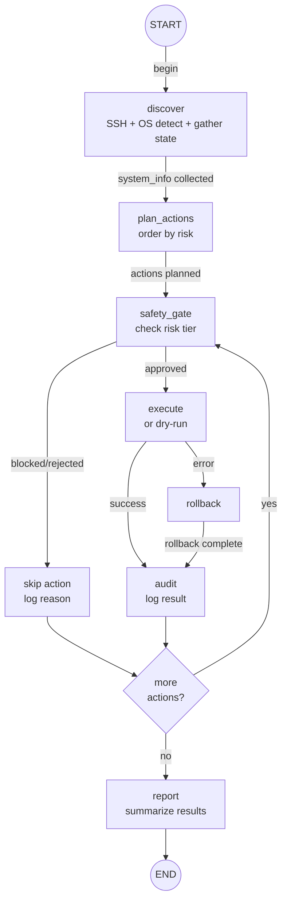
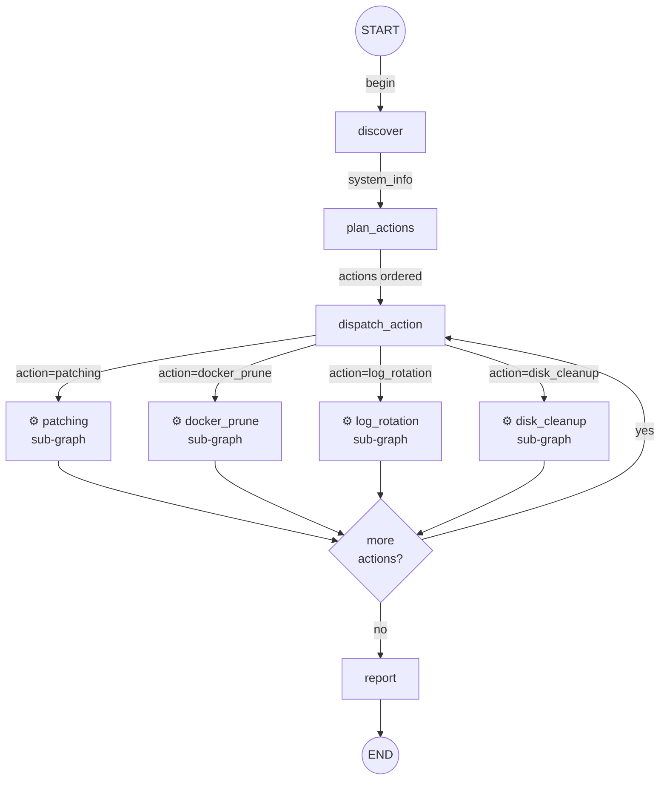
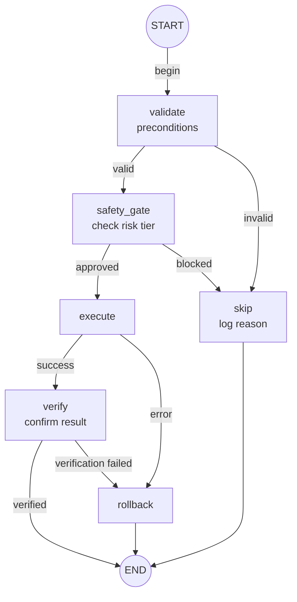
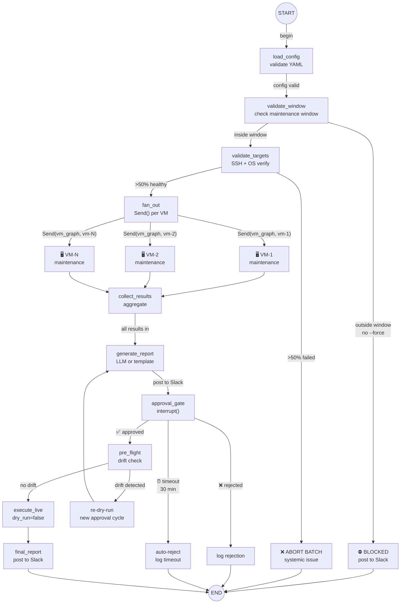
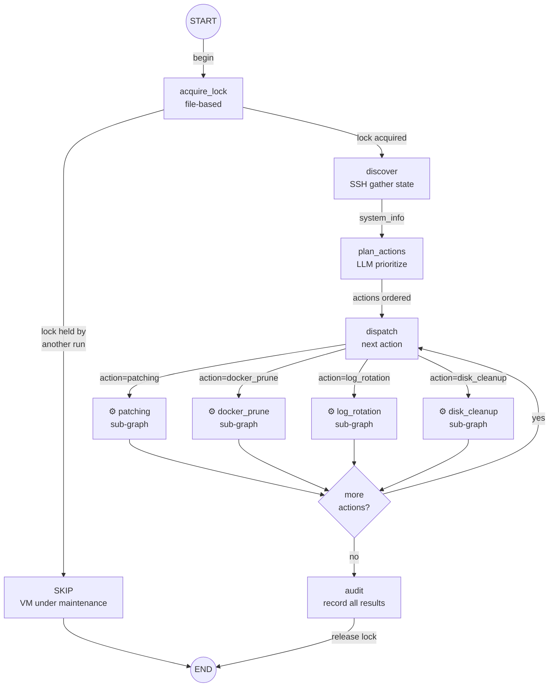
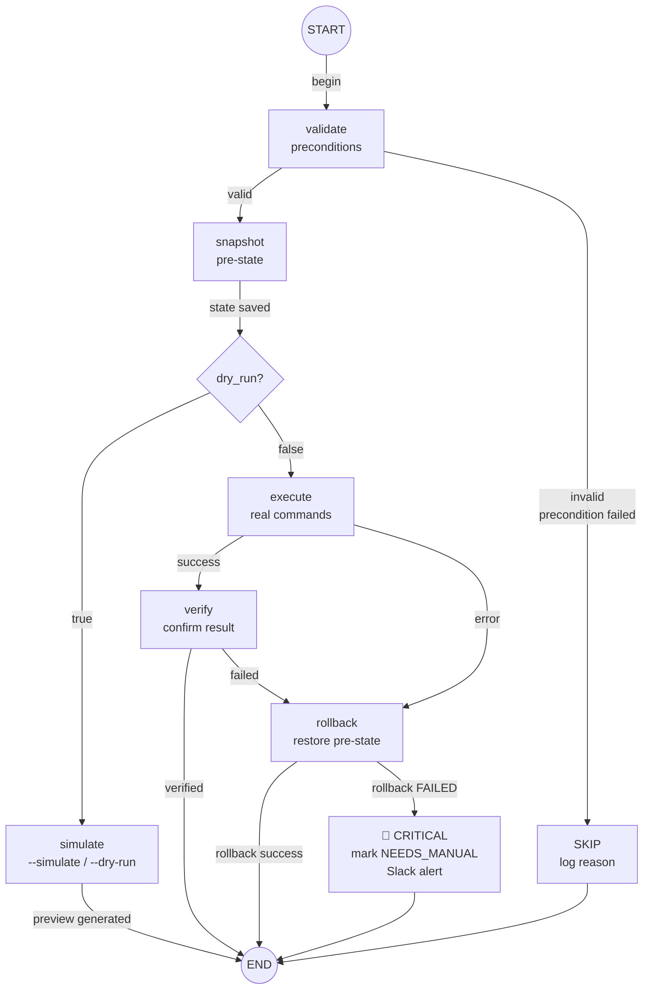

# Architecture Options for AutoMaint

Three approaches to structuring the LangGraph state machine. Each trades off simplicity, flexibility, and operational complexity.

---

## Option A: Single Flat Graph with Action Loop

One graph handles everything. A loop iterates through planned actions one at a time.



**How it works**:
- `discover`: SSH into VM, detect OS, gather system state (disk, packages, docker, logs)
- `plan_actions`: Decide which maintenance actions are needed, order them by risk (low first)
- Loop: for each action, run safety gate → execute (or dry-run) → audit → next action
- `report`: Summarize all results

**State**:
```python
class State(TypedDict):
    vm_id: str
    dry_run: bool
    os_family: str                          # ubuntu, rhel, debian
    system_info: dict                       # disk, packages, docker status
    planned_actions: list[Action]           # ordered action queue
    current_action_index: int               # loop cursor
    current_action: Action | None
    risk_tier: str                          # current action's risk
    approved: bool
    results: Annotated[list[ActionResult], add]
    error: str | None
    rollback_stack: list[RollbackRecord]    # completed actions that can be undone
```

**Tradeoffs**:

| Pro | Con |
|-----|-----|
| Simple — one graph, one state, easy to reason about | All action types share the same execute/rollback node (big switch statement or dispatch table) |
| Easy to checkpoint and resume — one thread per VM run | Adding a new action type means touching the dispatch logic |
| Natural ordering — low-risk first, stop on failure | Can't parallelize actions across multiple VMs without external orchestration |
| Rollback stack is straightforward — undo in reverse order | State grows large if many actions planned |

**Best for**: MVP. Get it working, prove the concept, refactor later if needed.

---

## Option B: Parent Orchestrator + Sub-Graphs per Action Type

A parent graph handles discovery, planning, and orchestration. Each action type (patching, docker prune, log rotation, etc.) is its own sub-graph with specialized logic.

Parent graph:


Action sub-graph (shared pattern):


**How it works**:
- Parent handles discovery, planning, action dispatch, and final reporting
- Each sub-graph encapsulates the full lifecycle of one action type: validate → gate → execute → verify → rollback
- Sub-graphs have their own state that maps to/from parent state
- `dispatch_action` uses conditional edges or `Command` to route to the right sub-graph

**State**:
```python
# Parent state
class OrchestratorState(TypedDict):
    vm_id: str
    dry_run: bool
    os_family: str
    system_info: dict
    planned_actions: list[Action]
    current_action_index: int
    results: Annotated[list[ActionResult], add]
    rollback_stack: list[RollbackRecord]

# Sub-graph state (example: patching)
class PatchingState(TypedDict):
    vm_id: str
    os_family: str
    dry_run: bool
    available_patches: list[Package]
    excluded_patches: list[str]       # kernel packages
    risk_tier: str
    approved: bool
    patch_output: str
    error: str | None
    rollback_command: str | None       # e.g., "apt-get install pkg=old_version"
```

**Tradeoffs**:

| Pro | Con |
|-----|-----|
| Clean separation — each action type has its own graph, state, and tests | More complex wiring — state transformation between parent and sub-graphs |
| Easy to add new action types — just add a new sub-graph | Checkpointing across parent + sub-graphs needs care |
| Each sub-graph can have custom validation and rollback logic | Harder to reason about the full flow — need to look at multiple graphs |
| Sub-graphs are independently testable | `interrupt()` in sub-graphs works but adds complexity to the resume flow |
| Type-safe state per action — no "one state fits all" bloat | Overkill if action types are simple and similar |

**Best for**: Production system with 5+ action types that have meaningfully different logic (different validation, different rollback strategies, different OS-specific commands).

---

## Option C: Parent Orchestrator + Fan-Out for Multi-VM

Like Option B, but adds a top-level fan-out to process multiple VMs in parallel.

Level 1 — Batch Orchestrator:


Level 2 — Per-VM Maintenance Graph:


Level 3 — Action Sub-Graph (with rollback paths):


**How it works**:
- `load_targets`: Read target VM list from config
- `fan_out`: Use LangGraph's `Send()` to spawn parallel sub-graph executions per VM
- Each VM gets its own maintenance graph (could be flat like Option A or nested like Option B)
- `collect_results`: Aggregate all VM results
- Human approval gates still work — `interrupt()` pauses individual VM flows

**State**:
```python
# Top-level state
class BatchState(TypedDict):
    targets: list[VMTarget]
    dry_run: bool
    vm_results: Annotated[list[VMResult], add]   # collected from all VMs
    batch_id: str

# Per-VM state (passed via Send)
class VMMaintenanceState(TypedDict):
    vm_id: str
    dry_run: bool
    os_family: str
    # ... same as Option A or B
```

**Tradeoffs**:

| Pro | Con |
|-----|-----|
| Process entire fleet in one invocation | Most complex option — three levels of nesting possible |
| Natural parallelism via `Send()` | Human approval for one VM blocks that branch but not others — need to track which VMs are waiting |
| One batch run = one audit trail | Error in one VM shouldn't stop others — need isolation |
| Can implement rolling updates (% of fleet at a time) | Harder to debug — which VM is stuck? |

**Best for**: Fleet-scale operations where you're maintaining 10+ VMs per run and need parallel execution.

---

## Recommendation

**Option C** — Parent Orchestrator + Fan-Out with Sub-Graphs per Action Type.

This is a production system intended to replace a DevOps engineer. The complexity is justified:

1. **Multi-VM parallelism is a core requirement, not a future add-on.** A DevOps engineer doesn't patch servers sequentially. The agent shouldn't either. `Send()` fan-out handles this natively.

2. **Action types diverge significantly in practice.** Patching has rollback-by-reinstall and kernel exclusion logic. Docker prune is fire-and-forget. Log rotation needs retention policies. Disk cleanup needs heuristics about what's safe to delete. These don't belong in a single dispatch table.

3. **Isolation = reliability.** A bug in docker prune logic must not take down the patching flow. Separate sub-graphs are separate failure domains with independent retry, rollback, and error handling.

4. **Extensibility.** Adding a new maintenance action should be: write a sub-graph, register it in the dispatcher. No modification to existing action logic.

5. **Debuggability.** Each sub-graph has its own checkpoints, its own state history, its own audit trail. When something fails at 3am, you can trace exactly what happened in the patching sub-graph on VM prod-3 without wading through unrelated docker prune state.

6. **Human approval scales.** With fan-out, `interrupt()` in one VM's high-risk action pauses only that branch. Other VMs continue processing low-risk actions. The operator sees a queue of pending approvals, not a fully blocked pipeline.

### Build order (not migration — build it right from the start)
```
Phase 1: Scaffold Option C structure (parent + sub-graphs + fan-out)
         Implement one action type end-to-end (e.g., disk_cleanup — lowest risk)
Phase 2: Add remaining action types as sub-graphs
Phase 3: Harden — rolling updates, fleet percentage caps, canary logic
```
