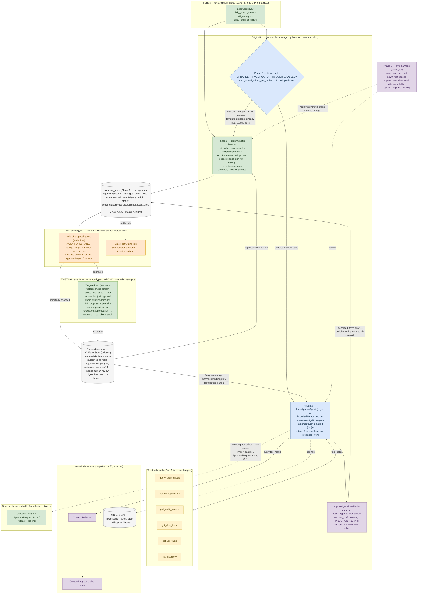

# Detect-and-Propose — Agentic Origination, HITL Execution (Implementation Diagram)

> Design-time diagram for the plan in `tasks/fable-plan.md`, reconciled against the current
> as-built code (post-R3 process split, post-2026-06-23 chat removal). Not yet implemented —
> see `tasks/todo.md` for status. Renders inline on GitHub. Companion to
> [`ARCHITECTURE.md`](../../ARCHITECTURE.md) at the repo root (whole-system view) and
> `investigation-agent-dashboard-chat.md` (the Plan A engine internals that Phase 2 adopts).

## Reading the diagram

- **Green (Layer B / deterministic)** — the probe, the Phase 1 detector, and the execution
  path. Note the detector is **not AI**: it turns raw probe signals into template proposals
  with no LLM, works when the LLM is down, and is the permanent fallback (design decision
  D2 in `tasks/fable-plan.md` §2). It also owns dedup — the investigator can only enrich
  what the detector's rules admit, never flood the queue.
- **Blue (Layer A)** — the only LLM-driven region: the Phase 3 trigger gate and the Phase 2
  investigation loop (internals unchanged from `investigation-agent-dashboard-chat.md`;
  Phase 2 adopts Plan A's runtime, tools, and guardrails wholesale). Its **only** output
  path runs through the purple validation gate into the proposal store — evidence and
  suggestions, never actions.
- **Purple (guardrails)** — redaction + budget on every hop (Plan A §5), plus the new
  `proposed_work` validation: hallucinated action types or VM ids are dropped and logged;
  every string field passes the `_INJECTION_RE` shell-pattern reject; evidence may cite
  only tools actually called.
- **Orange (human gate)** — every proposal passes a named, authenticated operator in the
  Web UI. Slack is notify-and-link, as everywhere else in Errander. The `approved` edge is
  the **only** edge from origination-side nodes into Layer B, and it is D1-shaped: approval
  originates a targeted run of the existing pipeline, which re-assesses fresh state and
  raises its own exact-object approval where the risk tier demands it. The Exact-Object
  invariant is reused, not paralleled.
- **Gray (stores)** — the new `proposal_store` (separate table and lifecycle from
  `approval_requests` — a proposal is a suggestion record, not an authorization), the
  existing `AIDecisionStore` (per-hop audit rows), and the existing `VMFactsStore` closing
  the memory loop in Phase 4 (suppression + context feedback into both origination paths).
- **The bottom green box** exists to make the safety argument visual, mirroring the Plan A
  diagram: the investigator has no code path — direct or transitive — into execution, SSH,
  `ApprovalRequestStore`, rollback, or locking. Test-enforced by an import-ban test
  (fable-plan §5.1), extending the pattern of `tests/web/test_import_isolation.py`.
- **Scope note:** phases refer to `tasks/fable-plan.md` §3. The dashboard chat (Plan B)
  does not appear here — it stays out of core per the 2026-06-23 decision; this pipeline
  is the in-core refinement of that decision (fable-plan §1).
