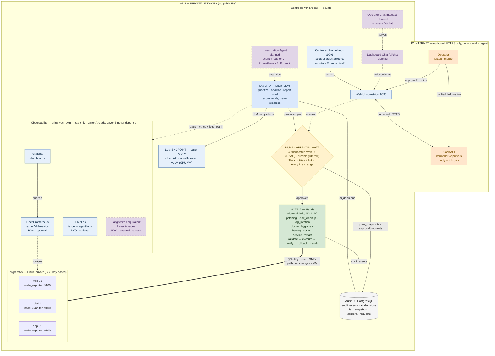

# Errander-AI — System Architecture

> Supervised agentic AI · two-layer safety model · the LLM recommends, humans approve, deterministic code acts.
> Renders inline on GitHub. The editable draw.io version is `errander-system-architecture.drawio` (same diagram).

## Reading the diagram

- **Layer A (blue)** thinks and recommends — never touches a VM.
- **Human approval gate (amber)** sits between thinking and acting — mandatory for every live change. Since §8d Step 2 each request is a durable row in `approval_requests`: decisions are atomic (exactly one winner), and a pending approval survives an agent restart (a reconciler job recovers it). Since §8d Step 3 (R2) the **only** decision surface is the authenticated Web UI with users/groups RBAC — every decision records a named user + group; Slack notifies and links but cannot decide.
- **Layer B (green)** is deterministic Python; the thick **SSH edge is the only path that changes a target VM**.
- **Two Prometheus instances:** the Controller Prometheus `:9091` *scrapes the agent* (monitors Errander itself); Fleet Prometheus separately *scrapes target node_exporters* `:9100` (opt-in, for Layer A to read when investigating fleet health).
- **Dashed purple** = planned (Investigation Agent, Dashboard Chat, Operator Chat Interface, LangSmith tracing).
- Everything inside **VPN** is private; the only outbound path is HTTPS to Slack (and optionally LangSmith).
- **Observability lane** is bring-your-own and read-only — Layer A may read these sources; Layer B never depends on them.
