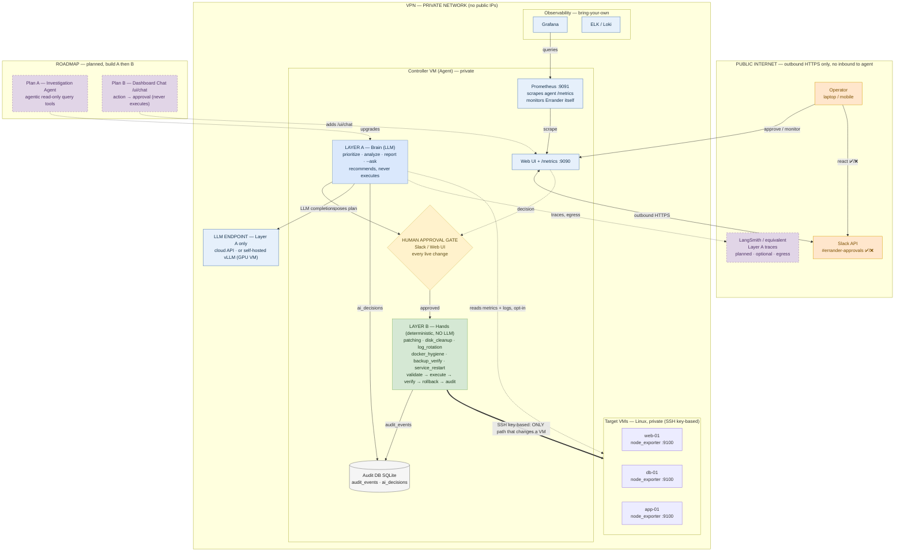

# Errander-AI — System Architecture

> Supervised agentic AI · two-layer safety model · the LLM recommends, humans approve, deterministic code acts.
> Renders inline on GitHub. The editable draw.io version is `errander-system-architecture.drawio` (same diagram).

## Reading the diagram

- **Layer A (blue)** thinks and recommends — never touches a VM.
- **Human approval gate (amber)** sits between thinking and acting — mandatory for every live change.
- **Layer B (green)** is deterministic Python; the thick **SSH edge is the only path that changes a target VM**.
- **Two Prometheus directions:** the controller-node Prometheus `:9091` *scrapes the agent* (monitors Errander); Layer A separately *reads target metrics/logs* (opt-in) to inform recommendations.
- **Dashed purple** = planned (LangSmith tracing, Plan A investigation agent, Plan B dashboard chat).
- Everything inside **VPN** is private; the only outbound path is HTTPS to Slack (and optionally LangSmith).
