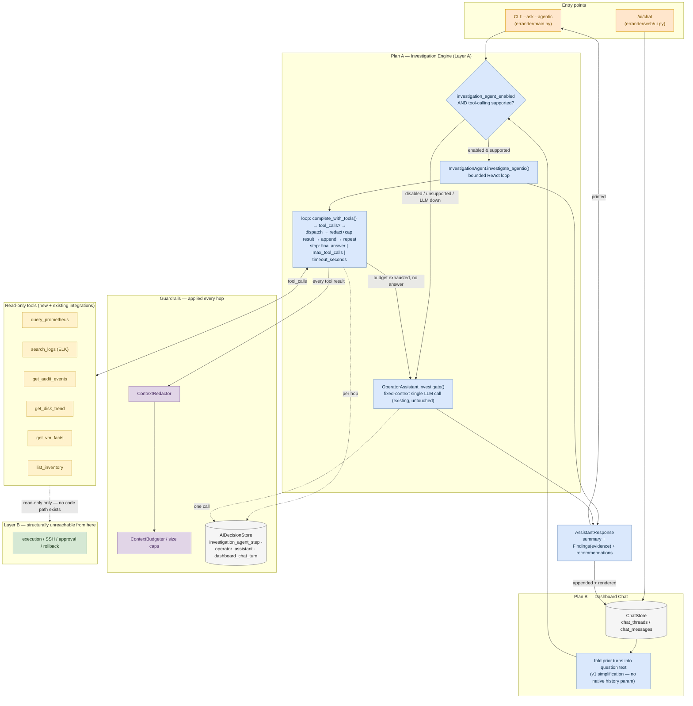

# Investigation Agent (Plan A) + Dashboard Chat (Plan B) — Implementation Diagram

> Design-time diagram for the plan in `tasks/investigation-agent-implementation-plan.md` and
> `tasks/dashboard-chat-implementation-plan.md`, reconciled against the current as-built code
> (post-R3 process split). Not yet implemented — see `tasks/todo.md` for status.
> Renders inline on GitHub. Companion to `errander-system-architecture.md` (the whole-system view).

## Reading the diagram

- **Blue (Layer A)** — the engine and its two paths: the new agentic loop, or the existing
  deterministic fallback (`OperatorAssistant.investigate()`, untouched). Both produce the same
  `AssistantResponse` contract, so the chat and the CLI can call either interchangeably.
- **Amber (tools)** — the six read-only tools the loop can call; each result is redacted + capped
  (purple) before it re-enters the model. Tool results are untrusted input.
- **Gray (stores)** — `ChatStore` (new, Plan B) and `AIDecisionStore` (existing, gains a new
  `decision_type="investigation_agent_step"` value alongside `operator_assistant` and the new
  `dashboard_chat_turn`).
- **Green (Layer B)** — drawn only to show it is *not connected* to anything above it. No tool, no
  loop iteration, no chat handler has a code path into execution/SSH/approval/rollback — that is
  the entire safety argument for this feature, made visual. Confirmed by `tests/web/test_import_isolation.py`
  (blocks `errander.execution`, `errander.agent.subgraphs`, `errander.agent.graph`,
  `errander.agent.vm_graph`) and the new `tests/agent/test_investigation_agent_isolation.py`.
- Both entry points (CLI `--ask --agentic` and the new `/ui/chat`) converge on the same decision
  gate — the chat is a thin surface over the Plan A engine, not a second brain, exactly as both
  source design docs (`tasks/investigation-agent-implementation-plan.md`,
  `tasks/dashboard-chat-implementation-plan.md`) require.
- **Scope note:** this diagram covers Plan A (phases 1–3) and Plan B phase 1 only (read-only
  chat). Streaming (SSE) and action handoff to the approval flow are Plan B phases 2–3, deferred —
  see the two source plans (`tasks/investigation-agent-implementation-plan.md`,
  `tasks/dashboard-chat-implementation-plan.md`) and `tasks/todo.md` for full scope and status.
