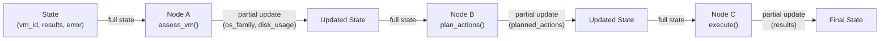
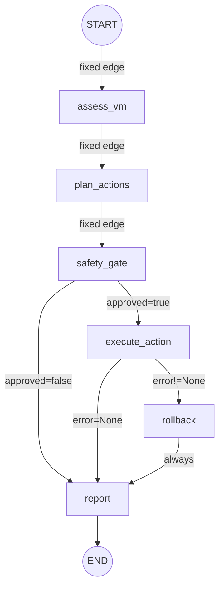
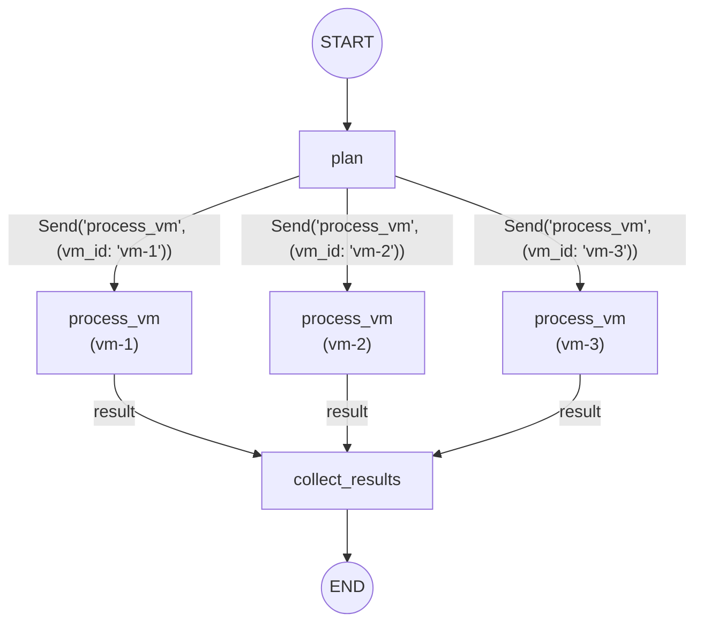
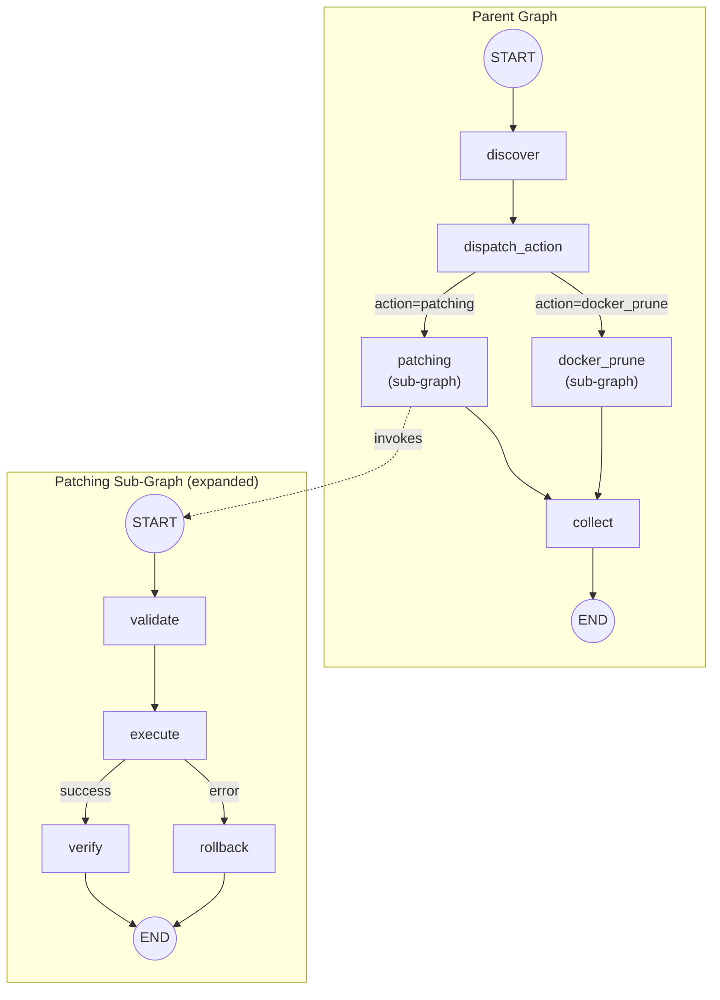
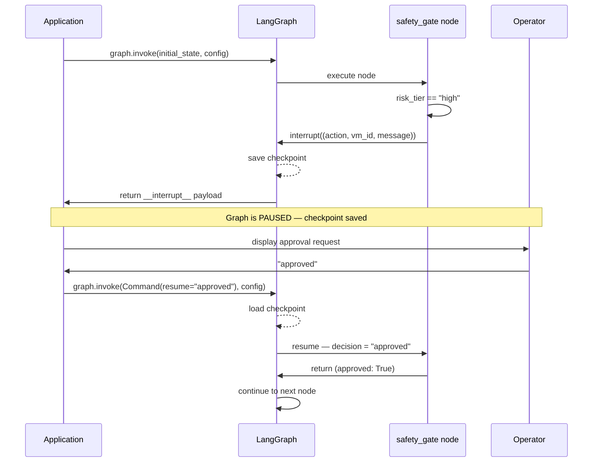

# LangGraph Primer for AutoMaint

Practical reference for building the AutoMaint agent. Skip theory — this is how things actually work.

---

## Core Mental Model

LangGraph = **state machine as code**. You define:

1. **State** — a shared dict that flows through the graph
2. **Nodes** — Python functions that read state, do work, return partial state updates
3. **Edges** — connections between nodes (fixed or conditional)

The graph runs in "super-steps": execute scheduled nodes → save checkpoint → route to next nodes → repeat until `END`.



---

## State

State is a `TypedDict` shared across all nodes. Each node receives the full state and returns a **partial dict** — only the keys it wants to update.

```python
from typing import TypedDict, Annotated
from operator import add

class MaintenanceState(TypedDict):
    vm_id: str                              # Overwritten on update (default)
    results: Annotated[list[str], add]      # Appended on update (reducer)
    error: str | None
```

**Default behavior**: returning `{"vm_id": "new"}` overwrites the old value.

**Reducers**: `Annotated[list[str], add]` means returning `{"results": ["new item"]}` *appends* to the existing list instead of replacing it. You can write custom reducers:

```python
def keep_max(current: int, update: int) -> int:
    return max(current, update)

class State(TypedDict):
    risk_score: Annotated[int, keep_max]
```

---

## Nodes

A node is any Python function (sync or async) that takes state and returns a partial update dict:

```python
def assess_vm(state: MaintenanceState) -> dict:
    vm = connect(state["vm_id"])
    return {
        "os_family": vm.detect_os(),
        "disk_usage": vm.check_disk(),
    }
```

Nodes can also accept `RunnableConfig` for accessing thread metadata:

```python
from langchain_core.runnables import RunnableConfig

def my_node(state: State, config: RunnableConfig) -> dict:
    thread_id = config["configurable"]["thread_id"]
    ...
```

---

## Edges and Conditional Routing

**Fixed edge** — always go A → B:
```python
builder.add_edge("assess", "plan")
```

**Conditional edge** — route based on state:
```python
def route_after_safety(state: State) -> str:
    if not state["approved"]:
        return "report"        # Must match a node name
    return "execute_action"

builder.add_conditional_edges("safety_gate", route_after_safety)
```

**Entry routing** — pick the first node dynamically:
```python
builder.add_conditional_edges(START, choose_first_node)
```



---

## The Command Pattern

Nodes can control routing *and* update state simultaneously:

```python
from langgraph.types import Command
from typing import Literal

def decide(state: State) -> Command[Literal["patch", "cleanup", "skip"]]:
    if state["disk_usage"] > 90:
        return Command(update={"priority": "urgent"}, goto="cleanup")
    return Command(goto="patch")
```

The `Literal` type hint tells LangGraph which outgoing edges exist — required for graph validation.

---

## Fan-Out with Send (Parallel Execution)

Process multiple VMs in parallel:

```python
from langgraph.types import Send

def fan_out(state: State):
    return [Send("process_vm", {"vm_id": vm}) for vm in state["target_vms"]]

builder.add_conditional_edges("plan", fan_out)
```



---

## Sub-Graphs

A compiled graph can be used as a node in a parent graph.

**Same state schema** — just pass the compiled graph:
```python
sub = sub_builder.compile()
parent_builder.add_node("patching_flow", sub)
```

**Different state schemas** — wrap in a transformation function:
```python
def call_patching(state: ParentState) -> dict:
    result = patching_subgraph.invoke({"target": state["vm_id"]})
    return {"patch_result": result["output"]}

parent_builder.add_node("patching", call_patching)
```

Checkpointers propagate automatically from parent to sub-graphs.



---

## Checkpointing (Persistence)

Checkpoints save full graph state at every super-step. Required for human-in-the-loop and fault recovery.

```python
from langgraph.checkpoint.memory import InMemorySaver  # Dev only
# Production: PostgresSaver, SqliteSaver

graph = builder.compile(checkpointer=InMemorySaver())

# Must provide thread_id
config = {"configurable": {"thread_id": "maint-run-42"}}
result = graph.invoke(initial_state, config)
```

**Inspect state**:
```python
snapshot = graph.get_state(config)
snapshot.values   # Current state
snapshot.next     # Next node(s) to execute
```

**Update state externally** (e.g., after human reviews):
```python
graph.update_state(config, {"approved": True}, as_node="human_approval")
```

---

## Human-in-the-Loop: `interrupt()`

The `interrupt()` function pauses a node and waits for external input. This is how safety gates work.

```python
from langgraph.types import interrupt, Command

def safety_gate(state: State):
    if state["risk_tier"] == "high":
        # Pause here — return payload to the caller
        decision = interrupt({
            "action": state["current_action"],
            "vm_id": state["vm_id"],
            "message": "High-risk action requires human approval"
        })
        # Resumes here when human responds
        return {"approved": decision == "approved"}
    return {"approved": True}
```

**Invoke and resume**:
```python
config = {"configurable": {"thread_id": "maint-1"}}

# First call — hits interrupt, returns payload
result = graph.invoke(initial_state, config)
# result contains __interrupt__ with the payload

# Human reviews, then resume
result = graph.invoke(Command(resume="approved"), config)
```

**Critical rules**:
- Never wrap `interrupt()` in bare `try/except` — it raises internally
- Code *before* `interrupt()` re-executes on resume — make it idempotent
- Values passed to `interrupt()` must be JSON-serializable



---

## Retry Policies

Attach retry behavior to nodes for transient failures (SSH timeouts, etc.):

```python
from langgraph.pregel import RetryPolicy

builder.add_node(
    "ssh_execute",
    ssh_execute_fn,
    retry=RetryPolicy(
        max_attempts=3,
        initial_interval=1.0,   # seconds before first retry
        backoff_factor=2.0,     # 1s, 2s, 4s
        max_interval=30.0,      # cap wait time
        jitter=True,            # randomize to avoid thundering herd
        retry_on=ConnectionError # only retry specific exceptions
    )
)
```

---

## Putting It Together

```python
from langgraph.graph import StateGraph, START, END

builder = StateGraph(MaintenanceState)

# Add nodes
builder.add_node("assess", assess_vm)
builder.add_node("plan", plan_actions)
builder.add_node("safety_gate", safety_gate)
builder.add_node("execute", execute_action, retry=RetryPolicy(max_attempts=3))
builder.add_node("rollback", rollback_action)
builder.add_node("report", report)

# Wire edges
builder.add_edge(START, "assess")
builder.add_edge("assess", "plan")
builder.add_edge("plan", "safety_gate")
builder.add_conditional_edges("safety_gate", route_after_safety)
builder.add_conditional_edges("execute", route_after_execute)
builder.add_edge("rollback", "report")
builder.add_edge("report", END)

# Compile
graph = builder.compile(checkpointer=InMemorySaver())
```
