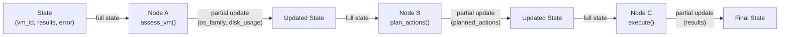
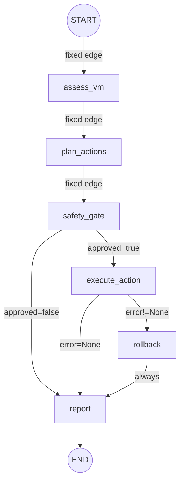
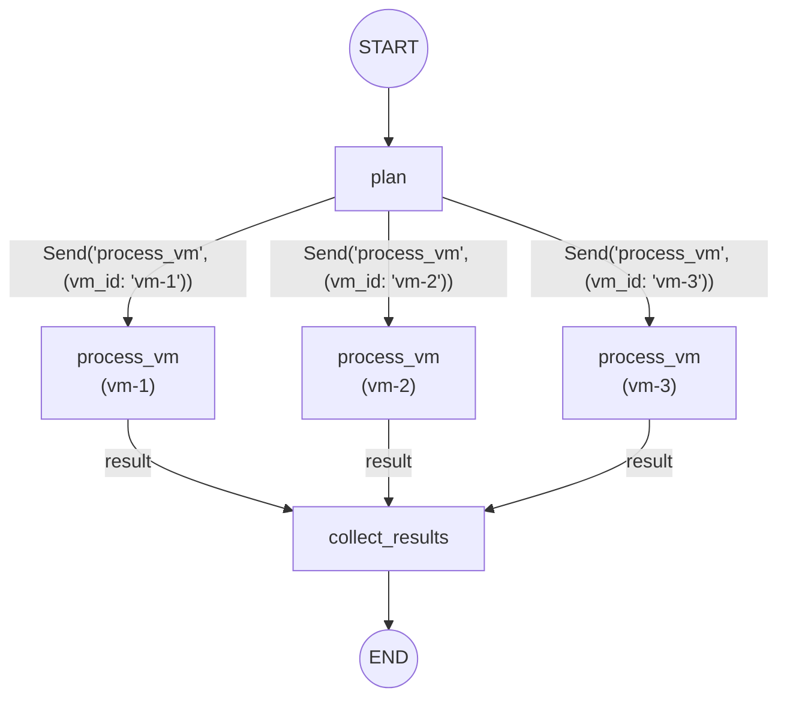
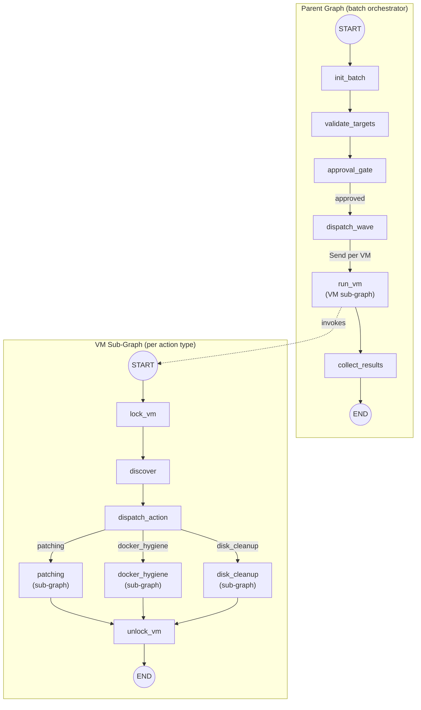
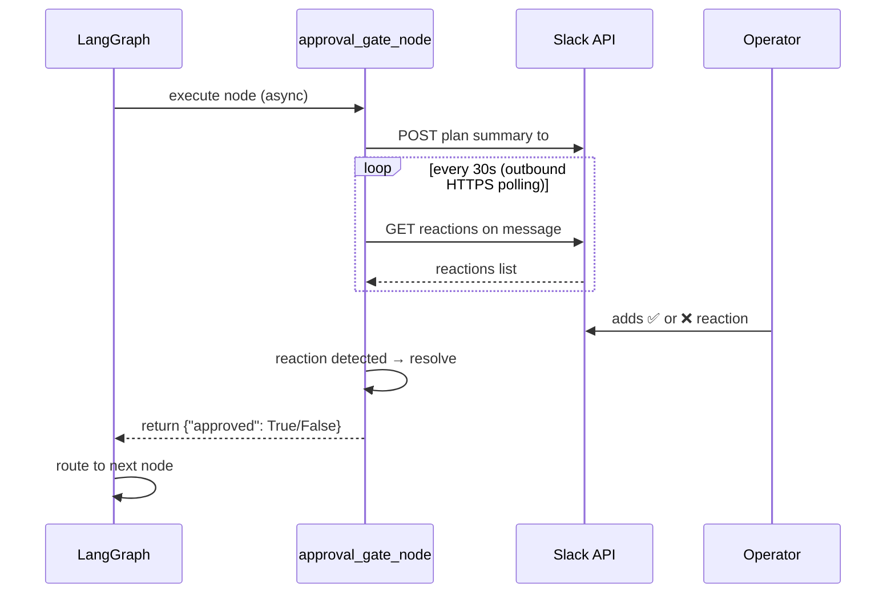
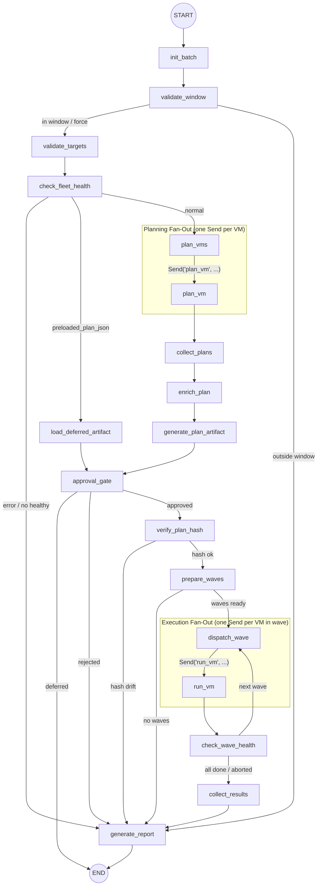

# LangGraph Primer for Errander-AI

Practical reference for building the Errander-AI agent. Skip theory — this is how things actually work.

---

## Core Mental Model

LangGraph = **state machine as code**. You define:

1. **State** — a shared dict that flows through the graph
2. **Nodes** — Python functions that read state, do work, return partial state updates
3. **Edges** — connections between nodes (fixed or conditional)

The graph runs in "super-steps": execute scheduled nodes → save checkpoint → route to next nodes → repeat until `END`.



---

## State

State is a `TypedDict` shared across all nodes. Each node receives the full state and returns a **partial dict** — only the keys it wants to update.

In Errander, state TypedDicts use `total=False` (all keys optional) and are defined **inline in their graph module** — not in a separate `state.py`. For example, `BatchGraphState` lives in `errander/agent/graph.py` and `VMGraphState` in `errander/agent/vm_graph.py`.

```python
from typing import TypedDict, Annotated
from operator import add

class MaintenanceState(TypedDict):
    vm_id: str                              # Overwritten on update (default)
    results: Annotated[list[str], add]      # Appended on update (reducer)
    error: str | None
```

**Default behavior**: returning `{"vm_id": "new"}` overwrites the old value.

**Reducers**: `Annotated[list[str], add]` means returning `{"results": ["new item"]}` *appends* to the existing list instead of replacing it. Errander uses custom reducers for aggregating results across VMs:

```python
def _merge_vm_results(
    existing: list[dict[str, object]],
    incoming: list[dict[str, object]],
) -> list[dict[str, object]]:
    return [*existing, *incoming]

class BatchGraphState(TypedDict, total=False):
    vm_results: Annotated[list[dict[str, object]], _merge_vm_results]
    vm_plans:   Annotated[list[dict[str, object]], _merge_vm_plans]
    # ... many more fields
```

---

## Nodes

A node is any Python function (sync or async) that takes state and returns a partial update dict:

```python
def assess_vm(state: MaintenanceState) -> dict:
    vm = connect(state["vm_id"])
    return {
        "os_family": vm.detect_os(),
        "disk_usage": vm.check_disk(),
    }
```

Nodes can also accept `RunnableConfig` for accessing thread metadata:

```python
from langchain_core.runnables import RunnableConfig

def my_node(state: State, config: RunnableConfig) -> dict:
    thread_id = config["configurable"]["thread_id"]
    ...
```

In Errander, most nodes are `async def` and dependencies (SSH manager, audit store, etc.) are injected via closures at graph-build time rather than passed through state:

```python
async def _validate_targets(state: BatchGraphState) -> dict[str, Any]:
    return await validate_targets_node(
        state, ssh_manager=ssh_manager, audit_store=audit_store,
    )

builder.add_node("validate_targets", _validate_targets)
```

---

## Edges and Conditional Routing

**Fixed edge** — always go A → B:
```python
builder.add_edge("assess", "plan")
```

**Conditional edge** — route based on state:
```python
def route_after_safety(state: State) -> str:
    if not state["approved"]:
        return "report"        # Must match a node name
    return "execute_action"

builder.add_conditional_edges("safety_gate", route_after_safety)
```

**Entry routing** — pick the first node dynamically:
```python
builder.add_conditional_edges(START, choose_first_node)
```



---

## The Command Pattern

Nodes can control routing *and* update state simultaneously:

```python
from langgraph.types import Command
from typing import Literal

def decide(state: State) -> Command[Literal["patch", "cleanup", "skip"]]:
    if state["disk_usage"] > 90:
        return Command(update={"priority": "urgent"}, goto="cleanup")
    return Command(goto="patch")
```

The `Literal` type hint tells LangGraph which outgoing edges exist — required for graph validation.

---

## Fan-Out with Send (Parallel Execution)

Process multiple VMs in parallel:

```python
from langgraph.types import Send

def fan_out(state: State):
    return [Send("process_vm", {"vm_id": vm}) for vm in state["target_vms"]]

builder.add_conditional_edges("plan", fan_out)
```



Errander uses **two fan-out phases** — one for planning, one for execution — with human approval between them. See the "Actual Batch Graph" section below.

---

## Sub-Graphs

A compiled graph can be used as a node in a parent graph.

**Same state schema** — just pass the compiled graph:
```python
sub = sub_builder.compile()
parent_builder.add_node("patching_flow", sub)
```

**Different state schemas** — wrap in a transformation function:
```python
def call_patching(state: ParentState) -> dict:
    result = patching_subgraph.invoke({"target": state["vm_id"]})
    return {"patch_result": result["output"]}

parent_builder.add_node("patching", call_patching)
```

Checkpointers propagate automatically from parent to sub-graphs.



---

## Checkpointing (Persistence)

Checkpoints save full graph state at every super-step. Required for LangGraph's native human-in-the-loop (`interrupt()`) and fault recovery.

```python
from langgraph.checkpoint.memory import InMemorySaver  # Dev only
# Production: PostgresSaver, SqliteSaver

graph = builder.compile(checkpointer=InMemorySaver())

# Must provide thread_id
config = {"configurable": {"thread_id": "maint-run-42"}}
result = graph.invoke(initial_state, config)
```

**Errander does not use LangGraph checkpointing.** Human approval is implemented as a regular async node that polls Slack — the graph never pauses mid-run. See "Approval in Errander" below.

---

## Human-in-the-Loop: LangGraph `interrupt()` vs Errander's Slack polling

LangGraph provides `interrupt()` to pause a graph mid-run and wait for external input:

```python
from langgraph.types import interrupt, Command

def safety_gate(state: State):
    if state["risk_tier"] == "high":
        decision = interrupt({
            "action": state["current_action"],
            "message": "High-risk action requires human approval"
        })
        return {"approved": decision == "approved"}
    return {"approved": True}
```

**Errander does not use `interrupt()`.** The architecture constraint is that all Slack communication is outbound HTTPS polling — no inbound webhooks, no public endpoints. LangGraph's `interrupt()` requires a checkpointer and an external system to call `graph.invoke(Command(resume=...), config)` to resume the graph, which needs an inbound connection.

Instead, Errander's approval gate is a plain `async def` node that blocks synchronously (from the graph's perspective) while polling Slack reactions:

```python
async def approval_gate_node(state: BatchGraphState, ...) -> dict[str, Any]:
    plan_summary = _format_plan_for_approval(vm_plans, batch_id, plan_id, plan_hash)

    # Post plan to Slack, then poll for ✅/❌ every 30s (outbound HTTPS only)
    approval_result = await await_dual_approval(
        approval_manager, slack_client, batch_id, plan_summary,
        timeout_seconds=1800,
        poll_interval_seconds=30,
    )
    approved, approver, approved_items = approval_result
    return {"approved": approved}
```

This node runs to completion before the graph routes to the next node — no checkpointing or resume needed. The tradeoff: the agent process must stay alive during the 30-minute approval window.



**Key rules for the approval gate:**
- Never wrap `await_dual_approval` in bare `try/except` — propagate timeouts as `approved=False`
- Dry-run batches auto-approve — sandbox execution is always safe
- `require_live_approval=True` (default) forces all live tiers through approval regardless of policy
- Approval outside the maintenance window → execution is deferred, not run immediately

---

## Retry Policies

Attach retry behavior to nodes for transient failures (SSH timeouts, etc.):

```python
from langgraph.pregel import RetryPolicy

builder.add_node(
    "ssh_execute",
    ssh_execute_fn,
    retry=RetryPolicy(
        max_attempts=3,
        initial_interval=1.0,   # seconds before first retry
        backoff_factor=2.0,     # 1s, 2s, 4s
        max_interval=30.0,      # cap wait time
        jitter=True,            # randomize to avoid thundering herd
        retry_on=ConnectionError # only retry specific exceptions
    )
)
```

---

## Actual Batch Graph (Errander v1.x)

The real batch orchestrator is more complex than a simple tutorial example. Two fan-out phases separated by human approval:



**Key design points:**
- `plan_vms` and `dispatch_wave` are no-op nodes; their conditional edges do the `Send()` fan-out work
- Approval happens **before** execution — the operator sees exact packages/versions via `enrich_plan`
- `verify_plan_hash` re-checks SHA-256 between approval and execution to catch state drift
- Waves implement rolling updates; canary is wave 0 with a stricter health check
- `load_deferred_artifact` bypasses planning for deferred replay (operator approved while outside window)

---

## Putting It Together (Simple Example)

```python
from langgraph.graph import StateGraph, START, END

builder = StateGraph(MaintenanceState)

# Add nodes
builder.add_node("assess", assess_vm)
builder.add_node("plan", plan_actions)
builder.add_node("safety_gate", safety_gate)
builder.add_node("execute", execute_action, retry=RetryPolicy(max_attempts=3))
builder.add_node("rollback", rollback_action)
builder.add_node("report", report)

# Wire edges
builder.add_edge(START, "assess")
builder.add_edge("assess", "plan")
builder.add_edge("plan", "safety_gate")
builder.add_conditional_edges("safety_gate", route_after_safety)
builder.add_conditional_edges("execute", route_after_execute)
builder.add_edge("rollback", "report")
builder.add_edge("report", END)

# Compile (no checkpointer — Errander uses Slack polling for approval)
graph = builder.compile()
```
