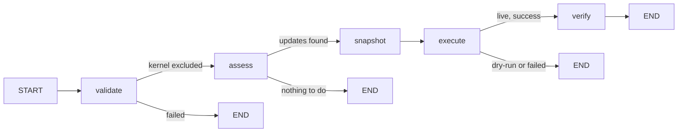

# 17 — Patching Sub-Graph (Phase 2)

## What Was Built

The patching sub-graph — the most complex of the five action types. It lists upgradable packages, filters out kernel packages (hardcoded, NEVER LLM-decided), snapshots current versions for rollback, performs the upgrade, and verifies the new versions. This is the only sub-graph with 5 nodes instead of 4.

## Why It's the Most Complex

Patching is Medium risk tier — it changes system state in ways that can break services. Three things make it harder than the other sub-graphs:

1. **Kernel exclusion must be absolutely bulletproof** — a kernel update could brick a production VM
2. **Rollback requires version snapshots** — we need to know what was installed before the upgrade
3. **OS-specific command parsing** — apt and dnf have completely different output formats

## Key Concepts

### 1. Mandatory Kernel Exclusion (Safety Critical)

This is the most important safety gate in the entire system:

```python
MANDATORY_KERNEL_EXCLUDES: frozenset[str] = frozenset({
    "linux-*",
    "linux-image-*",
    "linux-headers-*",
    "kernel-*",
    "kernel-core-*",
    "kernel-modules-*",
})
```

Why `frozenset`? It's immutable — no code can accidentally add or remove patterns at runtime. Why these patterns? They cover kernel packages on both Debian-family (`linux-*`) and RHEL-family (`kernel-*`) distributions.

The filter uses `fnmatch` for glob-style matching:

```python
def _is_kernel_package(package_name: str) -> bool:
    return any(
        fnmatch.fnmatch(package_name, pattern)
        for pattern in MANDATORY_KERNEL_EXCLUDES
    )
```

`fnmatch.fnmatch("linux-image-5.15.0-generic", "linux-image-*")` returns `True`. This is the same pattern matching that shells use for globs.

### 2. The Validate Node Merges, Never Replaces

The validate node doesn't just check that kernel packages are excluded — it **forces** them in:

```python
def validate_node(state: PatchingGraphState) -> dict[str, Any]:
    user_excludes = state.get("exclude_patterns", [])
    # Merge mandatory + user-provided — kernel patterns can never be removed
    all_excludes = list(MANDATORY_KERNEL_EXCLUDES | frozenset(user_excludes))
    return {"exclude_patterns": all_excludes, ...}
```

Even if someone passes `exclude_patterns=[]`, the mandatory kernel excludes are always applied. The `|` (union) operator on frozensets ensures both mandatory and user patterns are present. This design means:
- You can ADD exclusions (e.g., `["nginx-*"]` to skip nginx updates)
- You can NEVER remove kernel exclusions

### 3. Five-Node Graph (Unique Pattern)

Patching is the only sub-graph with a snapshot node between assess and execute:

```
validate → assess → snapshot → execute → verify → END
```

Why a separate snapshot node? Because the version snapshot is **critical safety infrastructure**. If we embedded it in the assess or execute node, a bug in the surrounding code could skip the snapshot. Making it its own node means:
- It has its own test suite
- It can't be accidentally bypassed
- The graph structure documents the requirement visually

```python
builder.add_conditional_edges("assess", route_after_assess, ["snapshot", END])
builder.add_edge("snapshot", "execute")  # unconditional — always snapshot before execute
```

Note: the edge from snapshot to execute is **unconditional** (`add_edge`, not `add_conditional_edges`). If assessment says there's work to do, we always snapshot before doing it.

### 4. OS-Specific Output Parsing

The `_parse_upgradable` function handles two completely different formats:

```python
# apt format: "package/source version arch [upgradable from: version]"
# Example: "curl/jammy-updates 7.81.0-1ubuntu1.16 amd64 [upgradable from: 7.81.0-1ubuntu1.15]"

# dnf format: "package.arch  version  repo"
# Example: "curl.x86_64  7.76.1-26.el9_4  baseos"
```

For apt: split on `/`, take the first element → `"curl"`.
For dnf: split on whitespace, take first element, remove `.arch` suffix → `"curl"`.

```python
if os_family in ("ubuntu", "debian"):
    if "/" in line:
        pkg = line.split("/")[0]
else:
    parts = line.split()
    pkg = parts[0].rsplit(".", 1)[0] if "." in parts[0] else parts[0]
```

### 5. Version Snapshot for Rollback

The snapshot node records `package=version` pairs using package manager queries:

```python
# AptManager: dpkg-query -W -f='${Package}=${Version}\n' pkg1 pkg2
# DnfManager: rpm -q --queryformat '%{NAME}=%{VERSION}-%{RELEASE}\n' pkg1 pkg2
```

The output is parsed by `_parse_versions`:

```python
def _parse_versions(output: str) -> dict[str, str]:
    versions: dict[str, str] = {}
    for line in output.strip().splitlines():
        if "=" in line:
            parts = line.strip().split("=", 1)
            if len(parts) == 2:
                versions[parts[0]] = parts[1]
    return versions
```

After patching, the verify node runs the same query and compares. If versions changed, it logs the diff. If rollback is ever needed, the snapshot provides the exact versions to downgrade to.

### 6. Execute Handles Failure Differently

Unlike other sub-graphs, the execute node checks for failure explicitly:

```python
status = ActionStatus.DRY_RUN_OK if executor.dry_run else ActionStatus.SUCCESS
if not result.success and not executor.dry_run:
    status = ActionStatus.FAILED
```

And the routing after execute handles the FAILED status:

```python
def route_after_execute(state: PatchingGraphState) -> str:
    if state.get("status") in (ActionStatus.DRY_RUN_OK.value, ActionStatus.FAILED.value):
        return END    # skip verify on failure OR dry-run
    return "verify"
```

If patching fails, we don't try to verify — we go straight to END. The audit trail captures the failure, and the report generator can recommend rollback using the version snapshot.

### 7. Reusing `get_package_manager_by_name`

The patching sub-graph imports the package manager factory from disk cleanup:

```python
from errander.agent.subgraphs.disk_cleanup import get_package_manager_by_name
```

This avoids duplicating the `os_family → PackageManager` mapping. Both sub-graphs need to generate OS-specific commands — one for cleanup, one for upgrades.

## Graph Flow



## Gotchas

1. **`fnmatch` is case-sensitive**: `fnmatch("Linux-Image-5.15", "linux-image-*")` returns `False`. Package names are lowercase on Debian and RHEL, so this works in practice, but it's worth knowing.

2. **`list_installed_versions` requires package names**: You can't just query "all installed packages" — the command takes specific package names. This means the snapshot only covers packages that were identified as upgradable.

3. **apt `--simulate` output is not machine-parseable**: The simulate command output varies by apt version. We use it for dry-run display, not for programmatic decisions.

4. **The snapshot node always runs if assess says there's work**: Even in dry-run mode! This is intentional — we want the dry-run report to show what versions would change.

## Quiz Yourself

1. Why is `MANDATORY_KERNEL_EXCLUDES` a `frozenset` instead of a regular `set` or `list`?
2. What happens if someone passes `exclude_patterns=["linux-*"]` — does it duplicate or deduplicate?
3. Why is snapshot a separate node instead of being part of the execute node?
4. How does `_parse_upgradable` tell the difference between apt and dnf output?
5. Why does the routing after execute check for FAILED status in addition to DRY_RUN_OK?
6. If the snapshot node fails (SSH error), what happens to the graph?
