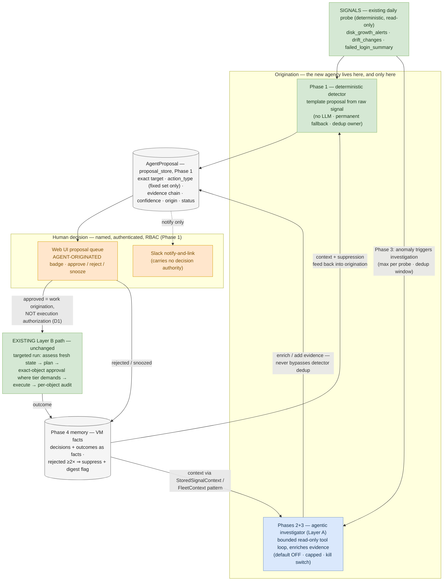

# Fable Plan — Detect-and-Propose: making Errander genuinely agentic (HITL preserved)

> **Status:** proposed, not started. Phased build plan for future implementation sessions.
> Read top-to-bottom before writing code. Phases are strictly ordered — each ships
> independently and keeps the tree green.
>
> **One-line goal:** give Errander real agency at the *origination* end — it notices
> signals, investigates autonomously (read-only), and files evidenced **proposals** into
> the existing approval pipeline — while execution stays exactly where it is:
> deterministic Layer B behind human approval.
>
> **Relationship to prior plans:**
> - `tasks/investigation-agent-implementation-plan.md` (Plan A) is the **reference spec
>   for Phase 2** — its runtime decision (§3), tool table (§4), and guardrails (§5) are
>   adopted wholesale. This plan re-aims its *output* (proposals, not just answers) and
>   its *trigger* (probe events, not just `--ask`).
> - `tasks/dashboard-chat-implementation-plan.md` (Plan B) stays **OUT of core** — the
>   2026-06-23 removal decision holds for the chat surface. See §1 for the reconciliation.

---

## 0. MANDATORY pre-flight (every implementation session)

1. **Read first:** `docs/AI-ARCHITECTURE.md` (two-layer model), `CLAUDE.md` → AI Safety
   Invariant + Exact-Object Approval + Implementation Contracts, `docs/OBSERVABILITY.md`.
2. **Grep `# INVARIANT:`** across `errander/` and `scripts/` and read every match —
   proposals originate destructive work, so the destructive-action pre-flight applies.
3. **The hard boundary, restated for this feature:**
   - The agent **originates and evidences** work. It never approves, schedules, or
     executes it. A proposal is a *suggestion record*, not an authorization.
   - Proposal approval by a human triggers the **existing** Layer B path (assess → plan
     → exact-object approval where required → execute → audit). No new execution path.
   - Every tool the investigator gets is read-only. No write tool, no SSH-exec tool, ever.
4. **Confirm git identity** (`psc0des` / `sarathy.vass6@gmail.com`). Doc-sync rule
   applies: code + docs in one atomic commit per phase.

---

## 1. Why — and the reconciliation with the 2026-06-23 removal

The project is named *supervised agentic AI*, but today the LLM's agency is advisory
commentary on plans a deterministic scheduler already made (`generate_planning_note`),
plus one-shot synthesis in `--ask`. Nothing in the system *originates* work from signals.

The 2026-06-23 decision removed two things together. They deserve different fates:

- **The chat UI (Plan B)** — a conversational surface is a system of insight with its own
  iteration speed, credential model, and eval needs. **Stays out.** That decision holds.
- **The investigate→propose loop** — this is not a system of insight. It *terminates in
  the core's own approval pipeline* and strengthens the core value proposition (evidence-
  quality approvals). It is the front end of the system of action. **Comes into core.**

Record exactly this distinction in `tasks/lessons.md` when Phase 0 lands, so future
sessions read it as a refinement of the June 23 decision, not a reversal.

**The demo this buys:** the nightly probe notices `web-01` gaining 2.1 GB/day for 6 days;
the agent correlates it with unrotated app logs (ELK) and a stalled logrotate unit
(audit history); by morning there is a proposal in the approval queue — evidence chain
attached — that one click routes into the existing approved execution path. An LLM you
ask questions of is a chatbot; this is an agent.

---

## 2. Architecture — the proposal pipeline

> Canonical rendered diagram (richer: guardrails, tools, Layer-B unreachability):
> `docs/diagrams/detect-and-propose.md`. Keep both in sync when the design changes.

Reading it: **green** is deterministic Layer B (existing code plus the Phase 1 detector —
note the detector is *not* AI); **blue** is the only LLM-driven box, and its sole output
is evidence attached to a proposal record; **orange** is the human gate every proposal
must pass; **gray** cylinders are Postgres stores. There is no arrow from the blue box to
execution — the investigator cannot reach Layer B even transitively, only the human
decision node can (test-enforced, guardrail §5.1).

**Design decision D1 — proposal approval is work origination, not execution
authorization.** An approved proposal triggers a *targeted* run of the existing
deterministic pipeline (single VM, single action — mirror the `--restart-service`
operator-triggered pattern). Layer B re-assesses fresh state and produces its own
approval artifact. For LOW categorical actions the proposal approval can carry through
as the approval (mirror the existing `[CATEGORICAL]` rules); for MEDIUM+ object-level
actions the exact-object gate still runs on fresh state. Rationale: the proposal's
evidence may be stale by execution time; the Exact-Object invariant already solves
staleness — reuse it, don't parallel it.

**Design decision D2 — LLM-optional at every stage.** Phase 1 works with no LLM at all
(template proposals from raw signals). The agentic investigator only ever *enriches*
what the deterministic detector could emit. LLM down ⇒ proposals still flow, with
thinner evidence. This preserves the "never blocked by LLM" rule and gives the honest
fallback story.

---

## 3. Phases

### Phase 0 — Decision record (30 min, docs only)
- [ ] `tasks/lessons.md`: record the chat-vs-loop distinction from §1.
- [ ] `docs/AI-ARCHITECTURE.md`: add a short "Detect-and-Propose (planned)" subsection —
      agency in origination, never in execution; link this plan.
- [ ] `README.md` roadmap: replace "separate future project" wording for the
      investigation loop (chat stays listed as separate).

### Phase 1 — Proposal bridge, deterministic only (the keystone; no LLM)
Ships standalone value: signal → proposal → approval queue → targeted Layer B run.

- [ ] `errander/models/proposals.py` — `AgentProposal` (Pydantic): `proposal_id`,
      `vm_id`, `action_type`, `origin` (`"probe_detector"` | `"investigation_agent"`),
      `signal_kind`, `evidence: list[Evidence]` (`source`, `query_or_check`,
      `observation`, `observed_at`), `confidence`, `risk_tier`, `status`
      (`pending/approved/rejected/snoozed/expired/superseded`), timestamps, `decided_by`.
- [ ] `errander/safety/proposal_store.py` — mirror `approval_store.py` conventions:
      async, DB-backed, atomic `decide()`, expiry (default 7 days), migration N+1.
      **Not** the approval store — separate table, separate lifecycle; a proposal that
      is approved *creates* work that then flows through `approval_requests` as today.
- [ ] Deterministic detector: post-probe hook in `agent/probe.py` / digest path —
      `disk_growth_alerts` → propose `disk_cleanup` (+ `log_rotation` if log paths
      implicated); `drift_changes` → propose **review-only** proposal (no action —
      surfaces evidence, operator decides); `failed_login_summary` spike → review-only.
      Template evidence built from the raw signal values.
- [ ] Dedup/suppression (minimum viable): one open proposal per (vm_id, action_type);
      re-probe refreshes evidence on the open proposal instead of duplicating.
- [ ] Web UI (`web/ui.py`): proposals queue page — badge **AGENT-ORIGINATED**, evidence
      chain rendered, approve/reject/snooze buttons behind existing RBAC; approval
      triggers the targeted run per D1.
- [ ] Slack notify-and-link on new proposal (existing notifier pattern; no decisions
      in Slack).
- [ ] CLI: `--proposals` (list), `--proposal-show <id>`.
- [ ] Audit: one `AuditEvent` per proposal lifecycle transition.
- [ ] Tests: store atomicity + expiry; detector emits correct proposals from synthetic
      probe results; dedup; RBAC on decide; approved proposal triggers targeted run;
      review-only proposals never trigger execution.

**Definition of done (P1):** probe run against a VM with a seeded disk-growth trend
produces a pending proposal visible in UI + Slack; approving it runs the targeted
deterministic path end-to-end (dry-run in tests); ruff/mypy/pytest clean; docs synced
(`docs/learning/XX-proposal-bridge.md`).

### Phase 2 — Agentic investigation engine (resurrect Plan A, re-aimed) — ✅ COMPLETE 2026-07-07
> Shipped: `chat_with_tools` (Decision A, hand-rolled loop), `investigation_tools.py`
> (audit/disk/vm_facts/inventory + Prometheus/ELK when configured), `investigation_agent.py`
> (bounded loop, per-hop redaction+audit, graceful fallback, `proposed_work` triple-validated
> → proposals via caller), `--ask --agentic` (default OFF). Prometheus/ELK tools use the
> existing fixed methods (no arbitrary-query generalization yet — deferred). See
> `docs/learning/61-investigation-agent-phase2.md`.

Implement `tasks/investigation-agent-implementation-plan.md` §3–§6 as written
(Decision A: hand-rolled tool loop on `LLMClient`; the six read-only tools; budgets;
per-hop redaction; per-step `AIDecisionStore` rows; graceful fallback). Deltas:

- [ ] Output contract extended: `AssistantResponse` gains optional
      `proposed_work: list[ProposedWorkItem]` (`vm_id`, `action_type`, rationale,
      evidence refs) — **validated against the fixed action set + inventory**; anything
      else is dropped and logged. The engine converts accepted items into
      `AgentProposal`s via the Phase 1 store (`origin="investigation_agent"`).
- [ ] Module lives in core (`errander/agent/investigation_agent.py`) — supersedes the
      "candidate separate project" framing per §1. Default OFF via settings, as in Plan A.
- [ ] `--ask --agentic` lands here too (Plan A Phase 3) — the same engine serves both
      operator questions and Phase 3 triggers. Keep it surface-agnostic.
- [ ] Tests: all of Plan A §7 Phase 2, plus: hallucinated action_type/vm_id in
      `proposed_work` is rejected; proposals created by the engine carry the evidence
      chain from tools actually called (cite-what-you-used validation).

### Phase 3 — Event-driven triggering (what makes it an agent) — ✅ COMPLETE 2026-07-07
> Shipped: `agent/investigation_trigger.py` — inline after the digest, sequential
> (T4-friendly), one `InvestigationAgent.investigate_agentic` call per affected VM.
> **Design delta from the checklist below:** dedup is **VM-level**, not
> per-signal-kind — one investigation per VM covers all its flagged signals in a
> single call (cheaper, one budget/fallback per VM, matches "an investigation run
> per affected VM" literally). A VM investigated within the window is skipped even
> for a newly-appeared signal kind; documented as a deliberate simplification in
> the module docstring. Dedup marker: `get_decisions(batch_id=f"probe-trigger:
> {vm_id}", decision_type="investigation_agent")`, counting only `outcome=="success"`
> (a prior failure never blocks a retry). Fallback is a `NoOpFallback` (not
> `OperatorAssistant`) — returns instantly, empty, so D2 costs zero extra LLM calls.
> See `docs/learning/62-investigation-trigger-phase3.md`.

- [x] Post-probe: anomaly signals enqueue an investigation run per affected VM
      (inline after digest, sequential — T4 constraint honored).
- [x] The investigation *enriches* the Phase 1 template proposal (attaches correlated
      evidence, adjusts confidence, may add a related proposal) — it never bypasses
      the detector's dedup (enrichment goes through `ProposalStore.create_or_refresh`,
      the same path `file_proposals()` uses).
- [x] Caps (settings, conservative defaults): `investigation_max_investigations_per_probe`
      (3), VM-level dedup window (`investigation_trigger_dedup_hours`, 24h — see delta
      above), global kill switch (`ERRANDER_INVESTIGATION_TRIGGER_ENABLED`, default `false`).
- [x] LLM down / unsupported ⇒ Phase 1 template proposal stands untouched (D2) — verified:
      `NoOpFallback` returns empty findings/proposed_work, enrichment is a no-op, zero
      audit writes.
- [x] Tests: 25 new (`test_investigation_trigger.py` 17: grouping, dedup window ×5,
      cap enforcement, enrichment, D2 untouched-on-failure, new-proposal dedup, one-VM-
      failure-doesn't-kill-loop, NoOpFallback; `test_investigation_isolation.py` +1;
      `test_main_probe.py` +3 kill-switch/no-LLM at the main.py wiring level). All green.

### Phase 4 — Memory loop (close it with what already exists) — ✅ COMPLETE 2026-07-09
> Shipped: `ProposalOutcomeFact` + `VMFactsStore.proposal_outcomes()` (derived from
> the Phase 1-3 `proposal_*` audit events, no new tables); `ProposalStore.is_suppressed`
> / `rejection_window_state` / `get_open` / `create_or_refresh_unless_suppressed`
> (Phase 1's `count_rejections` docstring literally said "suppression input (Phase 4)" —
> this is that input, now consumed); a single shared `file_or_suppress_one()` helper in
> `proposal_detector.py` that ALL THREE filing call sites (Phase 1 detector, Phase 3
> trigger's new-proposal filing, `--ask --agentic`'s filer) delegate to, so suppression
> and its `PROPOSAL_SUPPRESSED` audit trail are enforced identically regardless of
> origin — closing what would otherwise have been a suppression bypass via the agentic
> path. `FleetContext.proposal_history` + `_format_prompt` (deterministic `--ask`) and
> the `get_vm_facts` tool (agentic path) both surface it. `--vm-facts <vm_id>` CLI gained
> an "Agent proposal history" table with a SUPPRESSED-until-date annotation. See
> `docs/learning/63-suppression-memory-phase4.md`.
>
> **Scope delta from the checklist below:** suppression is scoped to **ACTION-kind
> proposals only** (a real `action_type`) — the plan's own wording ("rejected ≥2× for
> `(vm_id, action_type)`") already implied this; review-only proposals (drift, failed
> logins) are never suppressed, matching how re-surfacing that evidence daily is
> actually desired, not spam.

- [x] Proposal decisions + downstream run outcomes recorded as facts (extend the
      existing derivation to include proposal lifecycle events from Phase 1 audit rows).
- [x] Investigation context includes relevant facts (feed through the existing
      `FleetContext` pattern for `--ask`, and the `get_vm_facts` tool for `--ask --agentic`
      — both deterministic assembly, no new prompt-injection surface: counts + a
      timestamp only, no free-text fields).
- [x] Re-proposal suppression policy: rejected ≥2× for (vm_id, action_type) ⇒ suppress
      auto-proposals for N days (default 14) and surface a "suppressed — needs human
      review" line in the digest instead. Snooze honored verbatim (independent code path,
      regression-tested).
- [x] Tests: 29 new — suppression math (threshold/window boundaries, action-key
      isolation, ACTION-only scope) in `test_proposal_store.py`; snooze-unaffected
      regression; `ProposalOutcomeFact` derivation in `test_vm_facts.py`; facts appear in
      `FleetContext`/prompt/tool in `test_operator_assistant_facts.py`; digest line +
      Slack wording in `test_main_probe.py`; detector/trigger/agentic-filer suppression
      integration; CLI proposal-history + SUPPRESSED-status rendering. 576 tests across
      all Phase 1-4 touched areas green.

### Phase 5 — Evals + LangSmith (the credibility layer) — ✅ COMPLETE 2026-07-09
> Shipped: `errander/evals/golden_scenarios.py` (8 scenarios, synthetic `DigestReport`
> fixtures with known root causes, replayed through `detect_proposals()` + — for the
> suppression scenario — `file_or_suppress_one()` against a real store) and
> `errander/evals/agentic_guardrails.py` (4 scripted-fake-LLM scenarios regression-testing
> `investigation_agent.py`'s citation-honesty and `proposed_work` validation guardrails).
> Both offline by default (zero I/O, zero LLM); `--eval-golden-scenarios --live-llm`
> additionally smoke-tests the real configured endpoint (unscored — live output isn't
> deterministic). LangSmith wired via `LLMClient`-level `wrap_openai`, not LangGraph
> auto-instrumentation — see `docs/OBSERVABILITY.md` §4's corrected mechanism writeup.
> Actual numbers as of shipping: **8/8 golden scenarios, 100% precision/recall; 4/4
> guardrail scenarios.** See `docs/learning/64-eval-harness-langsmith-phase5.md`.

- [x] `errander/evals/` (matches the existing `replay.py`'s home, not `tests/evals/` —
      a deliberate consistency choice) — golden fleet scenarios: synthetic `DigestReport`
      fixtures with *known* root causes; replayed through the detector (+ the suppression
      scenario through the full store-backed filing path); score proposal precision/recall.
      Runs offline by default (zero I/O); the store-backed pytest path additionally
      exercises Phase 4 suppression against a real test-DB `ProposalStore`.
- [x] Evidence-citation / guardrail validity — a *separate* scenario set
      (`agentic_guardrails.py`) scripts an adversarial fake LLM against the real
      `InvestigationAgent` loop and asserts the existing guardrails hold (uncited-tool
      evidence stripped, non-proposable actions dropped, injected vm_ids dropped, a clean
      answer passes through unmodified).
- [x] LangSmith wiring per `docs/OBSERVABILITY.md` §4 (opt-in, off by default, egress
      note honored) — **with a correction to the doc's original premise**: the "attaches
      via env vars with no code changes" claim only holds for LangGraph-orchestrated code;
      Errander's actual Layer A calls are hand-rolled OpenAI SDK calls through `LLMClient`,
      so the real mechanism is `langsmith.wrappers.wrap_openai` wrapping `LLMClient`'s
      internal client — env-var-only activation is preserved, but the underlying mechanism
      needed correcting once actually implemented.
- [x] Report eval results in `docs/OBSERVABILITY.md` + README (honest numbers — 8/8 and
      4/4, offline, reproducible via `--eval-golden-scenarios`).
- [x] Tests: `tests/ai_evals/test_golden_fleet_scenarios.py` +
      `tests/ai_evals/test_agentic_guardrails.py` (placed alongside the existing
      `test_golden_plans.py`/`test_replay.py`, not a new `tests/evals/` — consistency with
      the established directory) — the real scenario registries plus, critically, tests
      that PROVE the harness isn't vacuously green (deliberately-wrong scenarios must be
      flagged as failing). `tests/integrations/test_llm.py` — `_maybe_wrap_for_tracing`
      default-off / enabled / ImportError-safe / wrap-failure-safe.

---

## 4. Explicitly OUT of scope

- The dashboard chat / any conversational UI (Plan B stays a separate future project).
- Any write-capable or SSH-exec tool for the agent. Any auto-execution or self-approval.
- New action types (proposals may only reference the existing fixed action set).
- Changes to the scheduled batch planner — `prioritize_actions` stays deterministic.
- Kernel operations (still Critical/blocked).

## 5. Guardrails (delta on Plan A §5 — those all still apply)

1. **The agent never touches the approval store.** Proposal store and approval store are
   separate types; the investigation module must not import `ApprovalRequestStore`
   (test-enforced, like the Layer B import ban).
2. **Proposals are inventory- and action-set-validated** at creation. No free-text
   targets, no free-text actions, no shell content anywhere in a proposal
   (`_INJECTION_RE` applies to all string fields).
3. **Rate-capped origination.** Caps in Phase 3 are mandatory, not tunable-to-infinity:
   enforce a hard ceiling in code above the settings value.
4. **Evidence honesty.** Every evidence entry names its source and query; entries citing
   tools that were not actually called are stripped (existing citation validation).
5. **Human-visible provenance.** UI/Slack always show origin badge + model + whether the
   LLM or the deterministic detector produced the proposal.

## 6. Definition of done (whole plan)

- [ ] A seeded anomaly on a test VM yields, with no human prompting: probe detection →
      (if enabled) bounded investigation → evidenced proposal in the queue → Slack
      notification → on approval, the existing Layer B path executes it → outcome fact
      recorded → repeat rejection suppresses re-proposal.
- [ ] With `ERRANDER_INVESTIGATION_TRIGGER_ENABLED=false` (default) and no LLM
      configured, Phase 1 detector still produces template proposals — zero regression
      to today's behavior otherwise.
- [ ] Eval harness runs in CI (offline mode); Layer-A isolation + guardrail tests green;
      ruff/mypy/pytest clean at every phase boundary.
- [ ] Docs synced per phase: STATUS.md, todo.md, lessons.md, command-log.md, plus
      AI-ARCHITECTURE.md, OBSERVABILITY.md, README.md, langgraph-primer.md (if graph
      wiring changes), and a `docs/learning/` doc per phase.

## 7. Risks / watch-outs

- **Two-gate fatigue (D1):** operators may resent approving a proposal *and* an
  exact-object plan for MEDIUM actions. Mitigation: the proposal approval page should
  say what the second gate will be; consider (later, not now) collapsing the gates when
  fresh assessment matches the proposal's evidence hash. Do not weaken the invariant
  to solve UX.
- **Proposal spam erodes trust faster than anything.** Ship suppression/dedup in
  Phase 1, not as a Phase 4 afterthought. A queue with three good proposals a week
  beats thirty noisy ones a day.
- **T4 latency on triggered investigations:** sequential runs, small cap, generous
  timeout; the template proposal is already filed before investigation starts, so a
  slow/failed investigation costs nothing.
- **Prompt injection via tool results:** unchanged from Plan A §10 — read-only tools
  bound the blast radius to a wrong *suggestion*, which a human then reads; redact +
  cap regardless. A poisoned log line must never be able to widen a proposal beyond
  the validated action set (guardrail 2 is the backstop).
- **Scope creep:** the moment anyone proposes an "auto-approve high-confidence
  proposals" flag, stop — that is self-approval with extra steps.
